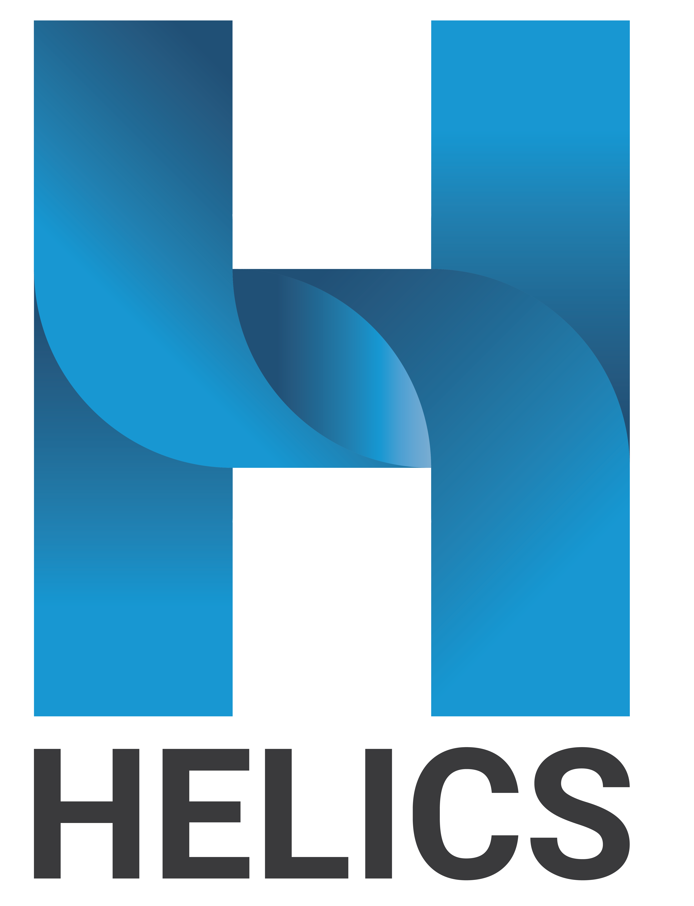

## Build Status

<table>
  <tr>
    <td><b>Service</b></td>
    <td><b>Master</b></td>
    <td><b>Develop</b></td>
    <td><b>helics3</b></td>
  </tr>
  <tr>
  <td>Azure</td>
  <td></td>
  <td></td>
  <td></td>
  </tr>
  <tr>
  <td>Circle-CI</td>
  <td></td>
  <td></td>
  <td></td>
  </tr>
  <td>Docs</td>
  <td></td>
  <td></td>
  <td></td>
  </tr>
</table>

## Table of contents

- [Introduction](#introduction)
- [Getting Started](#getting-started)
- [Documentation](#documentation)
  - [Changelog](#changelog)
  - [RoadMap](#roadmap)
- [Installers](#installers)
- [Building HELICS](#build-from-source-instructions)
- [Docker](#docker)
- [Tools with HELICS support](#tools-with-helics-support)
- [Contributing](#contributing)
- [Release](#release)

## Introduction

Welcome to the repository for the Hierarchical Engine for Large-scale Infrastructure Co-Simulation (HELICS). HELICS provides an open-source, general-purpose, modular, highly-scalable co-simulation framework that runs cross-platform (Linux, Windows, and Mac OS X). It is not a modeling tool by itself, but rather an integration tool that enables multiple existing simulation tools (and/or multiple instances of the same tool), known as "federates," to exchange data during runtime and stay synchronized in time such that together they act as one large simulation, or "federation". This enables bringing together established (or new/emerging) off-the-shelf tools from multiple domains to form a complex software-simulation without having to change the individual tools (known as "black-box" modeling). All that is required is for someone to write a thin interface layer for each tool that interfaces with existing simulation time control and data value updating, such as through an existing scripting interface. Moreover, the HELICS community has a growing ecosystem of established interfaces for popular tools, such that many users can simply mix and match existing tools with their own data and run complex co-simulations with minimal coding.

Today the core uses of HELICS are in the energy domain, where there is extensive and growing support for a wide-range of electric power system, natural gas, communications and control-schemes, transportation, buildings, and related domain tools. However, it is possible to use HELICS for co-simulation in any domain. Previous and existing HELICS efforts have stretched across a wide range of scales in time and space: From transient dynamics (e.g. power system frequency response or electromechanical transient simulation) through steady-state power flow and markets to long-term planning studies. And from individual appliance behaviors, through distribution & bulk systems, and to nation-wide simulations.

HELICS is also highly scalable, enabling everything from simple connections between 2 software federates on a laptop to large-scale simulations with 10s of thousands of federates (or more) running on high-performance computers, in the cloud, or a mix of all of these. Written in modern C++ (C++14), HELICS provides a rich set of APIs for other languages including [Python](#pip), C, Java, Octave, [Julia](https://github.com/GMLC-TDC/HELICS.jl), and Matlab. [nim](https://github.com/GMLC-TDC/helics.nim) and C# APIs are available on an experimental basis, and with an active open-source community, the set of supported languages and simulation tools is growing all the time.

**Brief History:** HELICS began as the core software development of the Grid Modernization Laboratory Consortium ([GMLC](https://gridmod.labworks.org/)) project on integrated Transmission-Distribution-Communication simulation (TDC, GMLC project 1.4.15) supported by the U.S. Department of Energy's Offices of Electricity Delivery and Energy Reliability ([OE](https://www.energy.gov/oe/office-electricity-delivery-and-energy-reliability)) and Energy Efficiency and Renewable Energy ([EERE](https://www.energy.gov/eere/office-energy-efficiency-renewable-energy)). As such, its first use cases were around modern electric power systems, though today it is used for a much larger range of applications. HELICS's layered, high-performance, co-simulation framework builds on the collective experience of multiple national labs.

**Motivation:** Energy systems and their associated information and communication technology systems are becoming increasingly intertwined. As a result, effectively designing, analyzing, and implementing modern energy systems increasingly relies on advanced modeling that simultaneously captures both the cyber and physical domains in combined simulations.

## Getting Started

The users guide has been completely redone for the upcoming HELICS 3. This version is not released yet but it is close, and the [docs](https://docs.helics.org/en/helics3/) are mostly done. We suggest you check it out if you are looking for more documentation.

We've created a series of roughly 10-minute mini-tutorial videos that discuss various design topics, concepts, and interfaces, including how to use the tool. They can be found on our [YouTube channel](https://www.youtube.com/channel/UCPa81c4BVXEYXt2EShTzbcg).

The [Introduction to the HELICS documentation](https://helics.readthedocs.io/en/latest/introduction/index.html) goes through a series of examples that step through the basic usage and concepts of HELICS.

Several examples of HELICS federates and projects are located in [HELICS-Examples](https://github.com/GMLC-TDC/HELICS-Examples). This repo provides a number of examples using the different libraries and interfaces.

The [HELICS-Tutorial repository](https://github.com/GMLC-TDC/HELICS-Tutorial) provides a series of tutorials using HELICS to build a co-simulation using domain-specific external modeling tools that is built around an electric power system use case with integrated transmission-distribution-market-communication quasi-steady-state-timeseries (QSTS) simulation.

The [HELICS-Use-Cases repository](https://github.com/GMLC-TDC/HELICS-Use-Cases) includes examples for a growing range of research use cases for inspiration.

A [Users guide](https://helics.readthedocs.io/en/latest/user-guide/index.html) for getting started

A [Tutorial](https://github.com/GMLC-TDC/pesgm-2019-helics-tutorial) was prepared for the IEEE PES General meeting in Atlanta. The example materials are available on Binder.

## Documentation

Our [ReadTheDocs](https://helics.readthedocs.io/en/latest/index.html) site provides a set of documentation including a set of introductory [examples](https://helics.readthedocs.io/en/latest/introduction/index.html), a [developers guide](https://helics.readthedocs.io/en/latest/developer-guide/index.html), complete Doxygen generated [API documentation](https://helics.readthedocs.io/en/latest/doxygen/annotated.html), and more. A few more questions and answers are available on the [Wiki](https://github.com/GMLC-TDC/HELICS/wiki).

### Documentation downloads

- [PDF](https://docs.helics.org/_/downloads/en/latest/pdf/)
- [HTML Zip file](https://docs.helics.org/_/downloads/en/latest/htmlzip/)
- [EPUB](https://docs.helics.org/_/downloads/en/latest/epub/)

Additionally, our initial design requirements document can be found [here](docs/introduction/original_specification.md), which describes a number of our early design considerations and some directions that might be possible in the future.

### [CHANGELOG](CHANGELOG.md)

For a history of changes to HELICS

### [ROADMAP](docs/ROADMAP.md)

For a snapshot of some current plans for what is to come

## Installers

### Windows

Each [release](https://github.com/GMLC-TDC/HELICS/releases/latest) comes with a Windows installer and zip file containing the HELICS apps and C shared library with Python 3.6 and Java 1.8 interfaces, zip files containing compiled HELICS static libraries built against several MSVC versions, and an archive containing just the C shared library with headers. For building with Debug support it is generally recommended to build from Source or use HELICS as a subproject.
Make sure the latest [Visual C++ Redistributable](https://support.microsoft.com/en-us/help/2977003/the-latest-supported-visual-c-downloads) is installed.

### Conda

Some support to Conda is provided see [conda install](https://helics.readthedocs.io/en/latest/installation/package_manager.html#install-using-conda-windows-macos-linux) for the instructions. It is supported through a separate [repo](https://github.com/GMLC-TDC/helics-conda).

### pip

Support for installing the Python interface and HELICS apps is provided with pip, see [pip install](https://helics.readthedocs.io/en/latest/installation/package_manager.html#install-using-pip-windows-macos-linux-other) for the instructions. The files used to build the pip package are in a separate [repo](https://github.com/GMLC-TDC/helics-packaging).

### Spack

HELICS can be installed on Linux (and macOS) using Spack, a package manager aimed at HPC environments. See [spack install](https://helics.readthedocs.io/en/latest/installation/package_manager.html#install-using-spack-macos-linux) for the instructions.

## Build from Source Instructions

[Windows](https://helics.readthedocs.io/en/latest/installation/windows.html)

[Mac](https://helics.readthedocs.io/en/latest/installation/mac.html)

[Ubuntu](https://helics.readthedocs.io/en/latest/installation/linux.html)

## Docker

Some of the HELICS apps are available from [docker](https://cloud.docker.com/u/helics/repository/docker/helics/helics). This image does not include any libraries for linking just the executables. `helics_broker`, `helics_app`, `helics_recorder`, `helics_player`, and `helics_broker_server`. Other images are expected to be available in the future. See [Docker](https://github.com/GMLC-TDC/HELICS/blob/master/docs/docker.md) for a few more details.

## Tools with HELICS support

As a co-simulation framework, HELICS is designed to bring together domain-specific modeling tools so they interact during run time. It effectively tries to build on the shoulders of giants by not reinventing trusted simulation tools, but instead, merely acting as a mediator to coordinate such interactions. HELICS's full power is only apparent when you use it to combine these domain-specific tools.

Thankfully the HELICS API is designed to be minimally invasive and make it straightforward to connect most any tool that provides either a scripting interface or access to source code. As listed below, a growing set of energy domain tools have HELICS support either natively or through an external interface. We also provide a set of helper apps for various utility and testing purposes.

We are always looking for help adding support for more tools, so please contact us if you have any additions.

[Tools](docs/Tools_using_HELICS.md)

### HELICS helper Apps

- [HELICS CLI](https://github.com/GMLC-TDC/helics-cli) provides a simple way to automate configuring, starting, and stopping HELICS co-simulations.
- [Player](https://helics.readthedocs.io/en/latest/apps/Player.html), which acts as a simple send-only federate that simply publishes a stream of timed HELICS messages from a user-defined file. HELICS Player is included in the HELICS distribution.
- [Recorder](https://helics.readthedocs.io/en/latest/apps/Recorder.html), which acts as a simple receive-only federate that prints out or saves messages from one or more subscribed streams. HELICS Recorder is included in the HELICS distribution.
- [Broker](https://helics.readthedocs.io/en/latest/apps/Broker.html), which is a command line tool for running a Broker. There is also a [Broker Server](https://helics.readthedocs.io/en/latest/user-guide/simultaneous_cosimulation) which can generate brokers as needed, and can include a REST API.
- [App](https://helics.readthedocs.io/en/latest/apps/App.htm) is a general app executable which can run a number of other apps including Player and Recorder, as well as a [Tracer](https://helics.readthedocs.io/en/latest/apps/App.html#tracer), [Echo](https://helics.readthedocs.io/en/latest/apps/App.html#echo), [Source](https://helics.readthedocs.io/en/latest/apps/App.html#source), and [Clone](https://helics.readthedocs.io/en/latest/apps/App.html#clone).

## Contributing

Contributors are welcome see the [Contributing](CONTRIBUTING.md) guidelines for more details on the process of contributing. And the [Code of Conduct](.github/CODE_OF_CONDUCT.md) for guidelines on the community expectations. All prior contributors can be found [here](CONTRIBUTORS.md)

### Optional components

A list of optional component that are not included in HELICS but are optionally used by the library

#### [zmq](http://www.zeromq.org)

ZeroMQ message passing is used in the ZMQ core networking. The automatic download currently uses version 4.3.1. No ZMQ library code is included in the HELICS source. HELICS installers include ZeroMQ binary libraries. ZeroMQ is licensed under [LGPL](https://github.com/zeromq/libzmq/blob/master/COPYING.LESSER) with a modification to allow for linking and in various forms and distribution of the binary under different terms if the library was not modified. Clarification on static linking being okay can be found in [this github issue](https://github.com/zeromq/libzmq/issues/3787). No modification of the ZMQ library or any of the ZeroMQ source files is included in the HELICS source code. Currently the Windows installers and shared library builds static link ZeroMQ. When building from source it is an optional component and can be excluded by setting `ENABLE_ZMQ_CORE` to `OFF`

### [Google Test](https://github.com/google/googletest)

HELICS tests are written to use the Google Test and mock frameworks. Google Test is included in the source tarball but is downloaded as an optional component. Google Test is released with a [BSD-3 clause](https://github.com/google/googletest/blob/master/LICENSE) license.

### [Google Benchmark](https://github.com/google/benchmark)

Some timing benchmarks with HELICS are written to use the Google Benchmark library. Benchmarks is an optional component and is not included in the main source tarball and must be downloaded separately. Google Benchmark is released with an [Apache 2.0](https://github.com/google/benchmark/blob/v1.5.0/LICENSE) license.

## Publications

\[1\] B. Palmintier, D. Krishnamurthy, P. Top, S. Smith, J. Daily, and J. Fuller, “Design of the HELICS High-Performance Transmission-Distribution-Communication-Market Co-Simulation Framework,” in _Proc. of the 2017 Workshop on Modeling and Simulation of Cyber-Physical Energy Systems_, Pittsburgh, PA, 2017. [pre-print](https://www.nrel.gov/docs/fy17osti/67928.pdf) | [published](https://ieeexplore.ieee.org/document/8064542/)

## In the News

HELICS was selected as an [R&D 100 Award Finalist](https://www.rdworldonline.com/finalists-announced-for-2019-rd-100-awards/).

## Source Repo

The HELICS source code is hosted on GitHub: [https://github.com/GMLC-TDC/HELICS](https://github.com/GMLC-TDC/HELICS)

## Release

HELICS is distributed under the terms of the BSD-3 clause license. All new
contributions must be made under this license. [LICENSE](LICENSE)

SPDX-License-Identifier: BSD-3-Clause

portions of the code written by LLNL with release number
LLNL-CODE-739319
