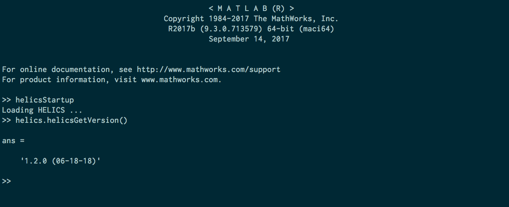

# HELICS with language bindings support

## HELICS with Python3

Run the following:

```bash
$ cmake -DBUILD_PYTHON_INTERFACE=ON -DCMAKE_INSTALL_PREFIX=/Users/$(whoami)/local/helics-x.x.x/ ..
$ make -j8
$ make install
```

Add the following to your `~/.bashrc` file.

```bash
export PYTHONPATH=/Users/$(whoami)/local/helics-x.x.x/python:$PYTHONPATH
```

If you open a interactive Python session and import helics, you should be able to get the version of `helics` and an output that is similar to the following.

```bash
$ ipython
Python 3.6.4 |Anaconda, Inc.| (default, Jan 16 2018, 12:04:33)
Type 'copyright', 'credits' or 'license' for more information
IPython 6.2.1 -- An enhanced Interactive Python. Type '?' for help.

In [1]: import helics

In [2]: helics.helicsGetVersion()
Out[2]: 'x.x.x (XX-XX-XX)'

```

## HELICS with Python2

Run the following:

```bash
$ cmake -DBUILD_PYTHON2_INTERFACE=ON -DPYTHON_INCLUDE_DIR=$(python2-config --prefix)/include/python2.7/ -DPYTHON_LIBRARY=$(python2-config --prefix)/lib/python2.7/libpython2.7.dylib -DCMAKE_INSTALL_PREFIX=/Users/$(whoami)/local/helics-x.x.x/ ..
$ make -j8
$ make install
```

Add the following to your `~/.bashrc` file.

```bash
export PYTHONPATH=/Users/$(whoami)/local/helics-x.x.x/python:$PYTHONPATH
```

If you open a interactive Python session and import helics, you should be able to get the version of `helics` and an output that is similar to the following.

```bash
$ ipython
Python 2.7.11 |Anaconda, Inc.| (default, Jan 16 2018, 12:04:33)
Type 'copyright', 'credits' or 'license' for more information
IPython 6.2.1 -- An enhanced Interactive Python. Type '?' for help.

In [1]: import helics

In [2]: helics.helicsGetVersion()
Out[2]: 'x.x.x (XX-XX-XX)'

```

## HELICS with GCC and Python3

First you will need to build boost using gcc from source. Download
[boost](http://www.boost.org/users/history/version_1_64_0.html) from the
boost.org website.

Unzip the folder boost\_1\_64\_0 to any location, for example Downloads.

```bash
$ cd ~/Downloads/boost_1_64_0
$ ./bootstrap.sh --with-python=/Users/$USER/miniconda3/python3 --prefix=/usr/local/Cellar/gcc/7.2.0_1/bin/gcc-7
$ ./bootstrap.sh --prefix=/ --prefix=/Users/$USER/local/boost-gcc-1.64
$ ./b2
$ ./b2 install
$ # OR
$ ./bjam cxxflags='-fPIC' cflags='-fPIC' -a link=static install # For static linking
```

This will install boost in the `~/local/boost-gcc-1.64` folder

Next, you will need to build HELICS and tell it what the BOOST\_ROOT is.

```bash
$ cmake -DCMAKE_INSTALL_PREFIX="/Users/$USER/local/helics-gcc-x.x.x/" -DBOOST_ROOT="/Users/$USER/local/boost-gcc-1.64" -DBUILD_PYTHON_INTERFACE=ON -DPYTHON_LIBRARY=$(python3-config --prefix)/lib/libpython3.6m.dylib -DPYTHON_INCLUDE_DIR=$(python3-config --prefix)/include/python3.6m -DCMAKE_C_COMPILER=/usr/local/Cellar/gcc/7.2.0_1/bin/gcc-7 -DCMAKE_CXX_COMPILER=/usr/local/Cellar/gcc/7.2.0_1/bin/g++-7 ../
$ make clean; make -j 4; make install
```

## HELICS with MATLAB

To install HELICS with MATLAB support, you will need to add `BUILD_MATLAB_INTERFACE=ON`.

```
git clone https://github.com/GMLC-TDC/HELICS
cd HELICS
mkdir build
cd build
cmake -DBUILD_MATLAB_INTERFACE=ON -DCMAKE_INSTALL_PREFIX=/Users/$(whoami)/local/helics-develop/ ..
make -j8
make install
```

On windows using visual studio the command line cmake would look like
```
cmake -DCMAKE_BUILD_TYPE=Release -DCMAKE_INSTALL_PREFIX="C:\local\helics-develop" -DENABLE_SWIG=OFF -DBUILD_MATLAB_INTERFACE=ON -G "Visual Studio 15 2017 Win64" ..

cmake --build . --config Release --target INSTALL
```
Cmake will search for the MATLAB executable and execute a mex command inside MATLAB to build the interface.
For this operation to succeed MATLAB must be available and mex must be setup to use an appropriate C compiler.  The setup is only required once for each MATLAB installation and does not need to repeated unless the compiler changes.  From within MATLAB run
```
>>mex -setup
```
and follow the prompted instructions.

Reconstructing the files requires a specific version of SWIG with MATLAB support. If swig is not used then adding `-DENABLE_SWIG=OFF` to the cmake command will bypass swig and use the included interface files directly.  If any modifications to the C library were made then swig must be used to regenerate the files appropriately, otherwise the existing files can be used.  The CMAKE scripts will detect if the swig is the appropriate version and act accordingly.

Add the install directory path to the MATLAB files to your PATH. This can be the system path, or the MATLAB path through the addpath command or the graphical equivalent
```
>> addpath('path/to/helics/install/matlab')
```

Now in MATLAB, run the following:

```
helicsStartup
display(helics.helicsGetVersion())
```



The helics Startup usually isn't required on Windows systems.  Alternatively, you can load the HELICS library manually, depending on which operating system you use.

```matlab
loadlibrary(GetFullPath('path/to/helics/install/libhelicsSharedLib.dylib'));
loadlibrary(GetFullPath('path/to/helics/install/libhelicsSharedLib.so'));
loadlibrary(GetFullPath('C:\path\to\helics\install\helicsSharedLib.dll'));

display(helics.helicsGetVersion())
```

This should print the version number of HELICS.


*Optional*

If you have changed the C-interface, and want to regenerate the SWIG MATLAB bindings, you will need to use a custom version of SWIG to build the MATLAB interface.
To do that, you can follow the following instructions.

- Install [SWIG with MATLAB](https://github.com/jaeandersson/swig/)
- `./configure --prefix=/Users/$USER/local/swig_install; make; make install;`
- Ensure that SWIG and MATLAB are in the PATH or specify them through the cmake-gui or ccmake.  Then make sure swig is enabled and the Matlab files will be generated by SWIG and compiled through MATLAB.


Alternatively, you wish to build the MATLAB interface without using CMake, and you can do the following.

```bash
cd ~/GitRepos/GMLC-TDC/HELICS/swig/
mex -I../src/helics/shared_api_library ./matlab/helics_wrap.cxx -lhelicsSharedLib -L/path/to/helics_install/lib/helics/
mv helicsMEX.* matlab/
```

The above instructions will have to be modified slightly to support Windows,  CMAKE is the recommended process for creating the MATLAB interface.

## HELICS with Octave

To install HELICS with Octave support, you will need to add `BUILD_OCTAVE_INTERFACE=ON`.

```
git clone https://github.com/GMLC-TDC/HELICS
cd HELICS
mkdir build
cd build
cmake -DBUILD_OCTAVE_INTERFACE=ON -DCMAKE_INSTALL_PREFIX=/Users/$(whoami)/local/helics-develop/ ..
make -j8
make install
```

add the octave folder in the install directory to the octave path
```
>>helics
>> helicsGetVersion()
ans = x.x.x (XX-XX-XX)
```

#### Notes
At present the interface to octave is experimental,  the testing is limited and not all functions are likely to have a clean interface, this will improve over time.
Octave 4.2 will require swig 3.0.12,  Octave 4.4 will require the develop branch of swig.  The Octave interface has built and run smoothly on Linux systems, and run through some limited trials.
On windows system the octave interface is not that reliable to build, while it has worked it hasn't been that smooth of process and has required some hacks to get it to work.  More work is likely needed.
