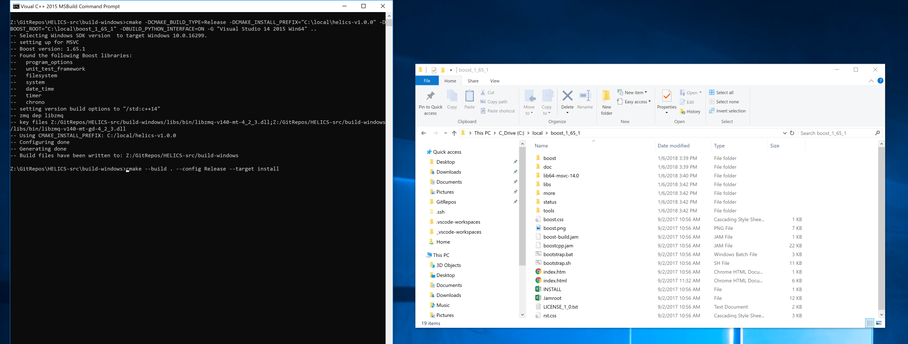
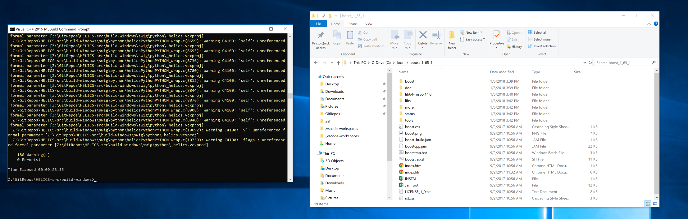
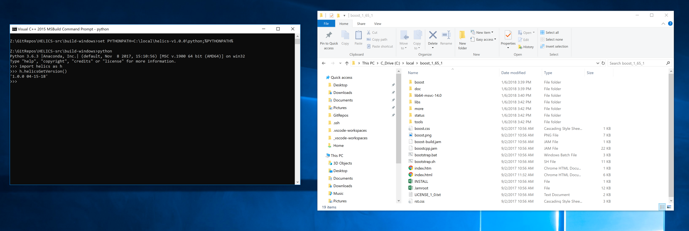

# Windows Installation


## Requirements

- Microsoft Visual C++ 2015 or newer (MS Build Tools also works)
- CMake 3.4 or newer
- git
- Boost 1.58 or newer
- ZeroMQ 4.2.0 or newer (if ZeroMQ support is needed)
- MS-MPI v8 or newer (if MPI support is needed)

## Setup

To set up your environment:

1. Install Microsoft Visual C++ 2015 or newer
2. Install
   [Boost](http://www.boost.org/doc/libs/1_64_0/more/getting_started/windows.html)
    [Windows downloads](https://dl.bintray.com/boostorg/release/1.66.0/binaries/)
   1.61 or later recommended (core library should build with 1.58,
   but tests will not). For CMake to detect it automatically either
   extract Boost to the root of your drive, or set the BOOST\_INSTALL\_PATH
   environment variable to the install location. The cmake will only automatically find
    boost 1.61 or newer.
   Building with Visual Studio 2017 will require boost 1.65.1 or newer and cmake 3.9
    or newer.  Use 14.0 versions for Visual Studio 2015, 14.1 files for Visual studio 2017.
    Boost 1.66 with cmake 3.11 is the current recommended configuration.
3. *Optional* Install [ZeroMQ](http://zeromq.org/build:_start) if you
   need ZeroMQ support and need a copy in a global system location.
   We recommend skipping this step and running cmake with the
   `AUTOBUILD_ZMQ=ON` option to automatically set up a project-only
   copy of ZeroMQ later on. The ZeroMQ Windows installer is **very**
   outdated and will not work with new versions of Visual Studio.
4. *Optional* Install
   [MS-MPI](https://msdn.microsoft.com/en-us/library/bb524831(v=vs.85).aspx)
   if you need MPI support.
5. *Optional* Install
   [SWIG](http://www.swig.org/download.html)
   if you wish to generate the interface libraries, appropriate build files are
    included in the repository so it shouldn't be necessary to regenerate unless the libraries are modified
6. Open a Visual Studio Command Prompt, and go to your working
   directory.
7. Make sure *cmake* and *git* are available in the Command Prompt.
   If they aren't, add them to the system PATH variable.

Getting and building from source:

1. Set up your environment.
2. Open a command prompt. Use git clone to check out a copy of
   HELICS.

```bash
git clone https://github.com/GMLC-TDC/HELICS-src.git
```

3. Go to the checkedout HELICS project folder (the default folder
   name is HELICS-src). Create a build folder and open the build
   folder. Alternatively, cmake-gui can be used.

```bash
cd HELICS-src
mkdir build
cd build
```

4. Run cmake. It should automatically detect where MPI is installed
   if the system path variables are set up correctly, otherwise you
   will have to set the cmake path manually. The AUTOBUILD_ZMQ is set to ON
    so ZeroMQ will automatically be built unless the option is changed.

```bash
cmake ..
```

If you need cmake to use a generator other than the default (ex:
selecting between a 32-bit or 64-bit project), the -G option can be
used to specify one of the generators listed by cmake --help. For
Visual Studio 2017, the generator name would be
`Visual Studio 15 2017 [arch]`, where \[arch\] is optional and can be
either Win64 for a 64-bit project, or left out to generate a 32-bit
project. To avoid problems when building later, this should match the
version of the Boost libraries you are using.

If you installed boost into the root of the C or D drives with the
default localtion (or the BOOST\_INSTALL\_PATH environment variable has been set),
cmake should automatically detect their location. Otherwise the
location will need to be manually given to cmake.

5. Open the Visual Studio solution generated by CMake. Under the
   *Build* menu, select *Build the Solution*. Alternatively, in the
   MSBuild command prompt, run the command msbuild HELICS.sln from
   the build folder to compile the entire solution. HELICS.sln can be
   replaced with the name of one of the projects to build only that
   part of HELICS.

## Windows Installers

Windows installers are available with the different [releases](https://github.com/GMLC-TDC/HELICS-src/releases).  The release includes installers for the Debug version and Release version. As well as a zip file of the install directory. The static libraries included with the installer will work with Visual Studio 2017.  

## Testing

A quick test is to double check the versions of the HELICS player and
recorder (located in the 'build\src\helics\apps\player\Debug' folder):

```bash
> cd C:\Path\To\build\src\helics\apps\Debug

> helics_player.exe --version
1.0.2 04-28-2018

> helics_recorder.exe --version
1.0.2 04-28-2018
```

## Building HELICS with python support

Setting `-DBUILD_PYTHON_INTERFACE=ON` will generate a project to build the python interface, if python is installed to a system
path then the appropriate libraries and flags will be automatically found.  If SWIG is available and you wish to regenerate the interface
set SWIG\_EXECUTABLE to the location of swig.exe.  Otherwise DISABLE\_SWIG can be set to ON to build using repo sources for the interface.
We highly recommend using Anaconda3/Miniconda3 for the Python distribution.
Additionally, you will need to ensure that the Python distribution used is built using the same compiler architecture (x86/x64) as the one you are using to build HELICS, as well as the one that was used to build Boost (as mentioned above).
ZeroMQ will be built using the CMake build process.




```bash
cmake -DCMAKE_BUILD_TYPE=Release -DCMAKE_INSTALL_PREFIX="C:\local\helics-v1.0.0"  -DBUILD_PYTHON_INTERFACE=ON -G "Visual Studio 14 2015 Win64" ..
cmake --build . --config Release --target install
```
otherwise they can be set through CMAKE flags
```bash
cmake -DCMAKE_BUILD_TYPE=Release -DCMAKE_INSTALL_PREFIX="C:\local\helics-v1.0.0"  -DBUILD_PYTHON_INTERFACE=ON -G "Visual Studio 14 2015 Win64" -DPYTHON_INCLUDE_DIR=$(python3-config --prefix)\include\python3.6m\ -DPYTHON_LIBRARY=$(python3-config --prefix)\lib\python3.6m\libpython3.6m.dll ..
cmake --build . --config Release --target install
```



Add the following to the Windows PYTHONPATH environment variable or run the following in the command line.

```bash
set PYTHONPATH=C:\local\helics-v1.0.2\python;%PYTHONPATH%
```

If you open a interactive Python session and import helics, you should be able to get the version of `helics` and an output that is similar to the following.

```bash
$ ipython
Python 3.6.4 |Anaconda, Inc.| (default, Jan 16 2018, 12:04:33)
Type 'copyright', 'credits' or 'license' for more information
IPython 6.2.1 -- An enhanced Interactive Python. Type '?' for help.

In [1]: import helics

In [2]: helics.helicsGetVersion()
Out[2]: '1.0.2 (04-28-18)'

```



## Building GridLAB-D and HELICS From Source on Windows with MSYS2 ##
### Overview ###
The latests release of GridLAB-D which is 4.1 will automatically come with the HELICS library bundled with it. However, The 4.1 release is not stable yet. Until then GridLAB-D and HELICS can be compiled together from source. The latest Develop branch of GridLAB-D can only be built on Windows using MSYS2. So both GridLAB-D and HELICS must be compiled using MSYS2. This page will layout the setting up of MSYS2 to compile and install HELICS and GridLAB-D. This guide will describe all the packages and install instructions for a 64bit build.

### Setting up MSYS2 ###
MSYS2 provides a linux like terminal environment on your Windows system. MSYS2 can be installed from [here](https://www.msys2.org/). Once MSYS2 has been installed start up msys2.exe. Follow first time updates as described on the MSYS2 website. After MSYS2 has been successfully updated Some packages need to be installed in order to configure and build GridLAB-D and HELICS. The following packages need to be installed:
- base-devel
- mingw-w64-x86_64-toolchain
- git
- mingw-w64-x86_64-cmake
- mingw-w64-x86_64-boost
- mingw-w64-x86_64-qt5 (only if you want to be able to run cmake-gui which this guide recommends.)
- mingw-w64-x86_64-dlfcn
- mingw-w64-x86_64-xerces-c
- mingw-w64-x86_64-zeromq

All packages can be installed by typing the following:
```bash
$ pacman -S --needed base-devel mingw-w64_x86_64-toolchain mingw-w64-x86_64-cmake mingw-w64-x86_64-boost mingw-w64-x86_64-qt5 mingw-w64-x86_64-dlfcn mingw-w64-x86_64-xerces-c
```
One issue that the boost package has when building with GridLAB-D with HELICS on MSYS2 is all the boost libraries have a -mt in their names. In order for GridLAB-D to find these libraries the -mt must be removed from the libboost*-mt.dll files located in /mingw64/bin. Work is in progress to remove this modification in MSYS2 builds.

After all this has been done /mingw64/bin must be added to the PATH environment variable.
```bash
$ export PATH=$PATH:/mingw65/bin
```

### Download HELICS and GridLAB-D Source Code ###
Now that the MSYS2 environment has been setup and all prerequisite packages have been installed the source code can be compiled and installed. The HELICS source code can be cloned from GitHub by performing the following:
```bash
$ git clone https://github.com/GMLC-TDC/HELICS-src.git
```
git will clone the source code into a folder in the current working directory called HELICS-src. This path will be refered to by this guide as HELICS_ROOT_DIR.

The GridLAB-D source code can be cloned from GitHub by perfoming the following:
```bash
$ git clone https://github.com/gridlab-d/gridlab-d.git
```
git will clone the source code into a folder in the current working directory called gridlab-d. This path will be refered to by this guide as GLD_ROOT_DIR.

As of the writting of this guide the only GridLAB-D branch that can be compiled with HELICS is the develop branch. So you must checkout the develop branch of the GridLAB-D repository. Change your working directory to GLD_ROOT_DIR and then checkout the develop branch:
```bash
$ git checkout -b develop origin/develop
```

### Compiling HELICS From Source ###
Change directories to HELICS_ROOT_DIR. Create a directory called helics-build. This can be accomplished by using the mkdir command. cd into this directory. Now type the following:
```bash
$ cmake-gui ../
```
If this failes that is because mingw-w64-x86_64-qt5 was not installed. If you did install it the cmake gui window should pop up. click the Advanced check box next to the search bar. Then click Configure. A window will pop up asking you to specify the generator for this project. Select MSYS Makesfiles from the dropdown menu. Then click the Specify native compilers check box and click next. Enter C:/msys64/mingw64/bin/gcc.exe for the C compiler and C:/msys64/mingw64/bin/g++.exe for the C++ compiler and click finish. Once the Configure process finished several variables will show up highlighted in red. Since this is the first time setup the Boost and ZeroMQ library. Below are the following cmake variables that need to be verified.

* BUILD_CXX_SHARED_LIB should be checked as GridLAB-D dynamically links with the shared c++ library of HELICS
* Boost_CHRONO_LIBRARY_DEBUG/RELEASE C:/msys64/mingw64/bin/libboost_chrono.dll
* Boost_DATE_TIME_LIBRARY_DEBUG/RELEASE C:/msys64/mingw64/bin/libboost_date_time.dll
* Boost_FILESYSTEM_LIBRARY_DEBUG/RELEASE C:/msys64/mingw64/bin/libboost_filesystem.dll
* Boost_INCLUDE_DIR C:/msys64/mingw64/include
* Boost_LIBRARY_DIR_DEBUG/RELEASE C:/msys64/mingw64/bin
* Boost_PROGRAM_OPTIONS_LIBRARY_DEBUG/RELEASE C:/msys64/mingw64/bin/libboost_program_options.dll
* Boost_SYSTEM_LIBRARY_DEBUG/RELEASE C:/msys64/mingw64/bin/libboost_system.dll
* Boost_TIMER_LIBRARY_DEBUG/RELEASE C:/msys64/mingw64/bin/libboost_timer.dll
* Boost_UNIT_TEST_FRAMEWORK_LIBRARY_DEBUG/RELEASE C:/msys64/mingw64/bin/libboost_unit_test_framework.dll
* CMAKE_CXX_FLAGS -std=gnu++14
* CMAKE_INSTALL_PREFIX /usr/local or location of your choice
* ZeroMQ_INCLUDE_DIR C:/msys64/mingw64/include
* ZeroMQ_INSTALL_PATH C:/msys64/mingw64
* ZeroMQ_LIBRARY C:/msys64/mingw64/bin/libzmq.dll
* ZeroMQ_ROOT_DIR C:/msys64/mingw64

Once these cmake variables have been correctly varified click Configure. Once that is complete click Generate then once that is complete the CMake gui can be closed.

Back in the MSYS2 command window type:
```bash
$ make -j x
```
where x is the number of threads you can give the make process to speed up the build. Then once that is complete type:
```bash
$ make install
```
unless you changed the value of CMAKE_INSTALL_PREFIX everything the default install location /usr/local/helics_1_3_0. This install path will be refered to as HELICS_INSTALL for the next section.

### Compiling GridLAB-D From Source ###
Change directories to the GLD_ROOT_DIR. If this is the first time compiling GridLAB-D from source then type the following:
```bash
$ autoreconf -if
```
Once that is complete type:
```bash
$ ./configure --build=x86_64-w64-mingw32 --prefix=<your disired installation prefix> --with-xerces=/mingw64 --with-helics=HELICS_INSTALL --enable-silent-rules 'CFLAGS=-g -O2 -w' 'CXXFLAGS=-g -O2 -w -std=gnu++14' 'LDFLAGS=-g -O2 -w'
```
Once that is complete type:
```bash
$ make -j x
```
where x is the number of threads you can give the make process to speed up the build. Once that is complete type:
```bash
$ make install
```

### System Environment Notes ###
When operating a GridLAB-D model as a HELICS federate it will be necessary to for the windows path variable to contain the path containing the HELICS c++ shared library otherwise GridLAB-D will fail to run.