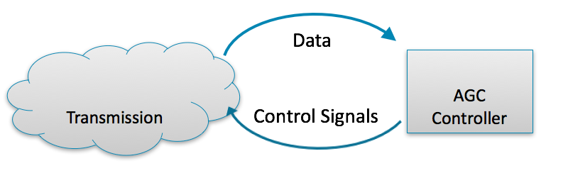
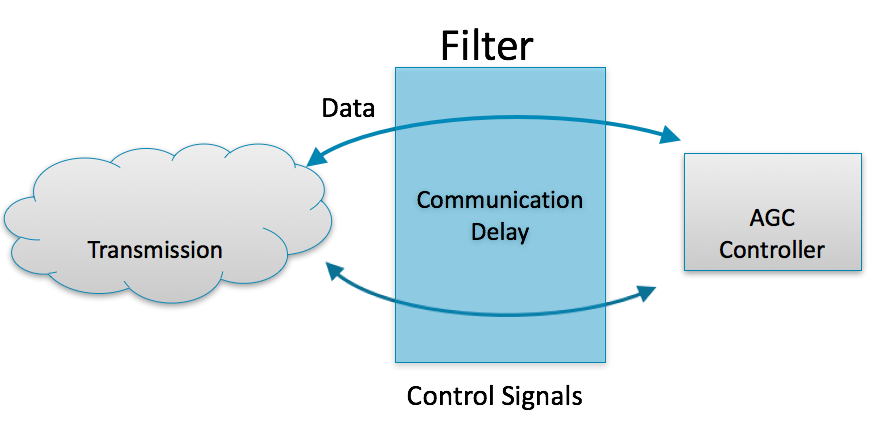
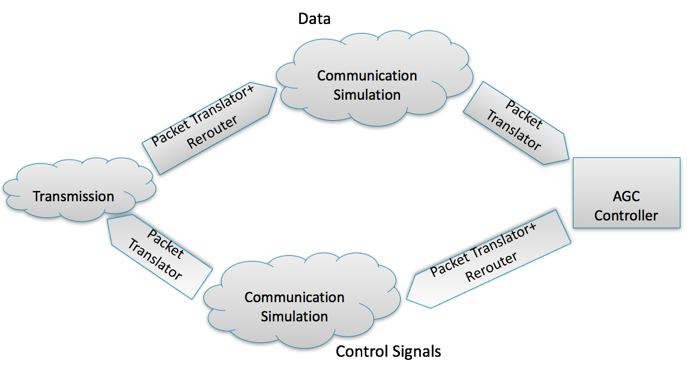

# Filters

1.  Inline operations that can alter a message or events

    - Time Delay (Random or Fixed)
    - Packet Translation
    - Random Dropping
    - Message Cloning / Replication
    - Rerouting
    - Firewall
    - Custom

2.  Filters are part of the Core, and the effect of a filter is not
    limited to the endpoints of local objects

3.  Filters can have multiple target endpoints, and trigger off either messages sent from an endpoint (source target) or messages received by an endpoint (destination targets)

4.  Filters can be cloning or non-cloning filters. Cloning filters will operate on a copy of the message and in the simple form just deliver a copy to the specified destination locations. The original message gets delivered as it would have without the filter.

## Federation

## Example with delay

## Example with communication system

