# Running hello_world example using HELICS windows installer + Visual Studio 2019

**1. Make sure that you have downloaded HELICS through the installer**

- To get to the installer you can access it through either of the following links:

  - [https://github.com/GMLC-TDC/HELICS/releases](https://github.com/GMLC-TDC/HELICS/releases)
  - [https://docs.helics.org/en/latest/installation/index.html](https://docs.helics.org/en/latest/installation/index.html) - where you will see this:

  

- Once you have gotten to the list of releases, you will see something like this:

  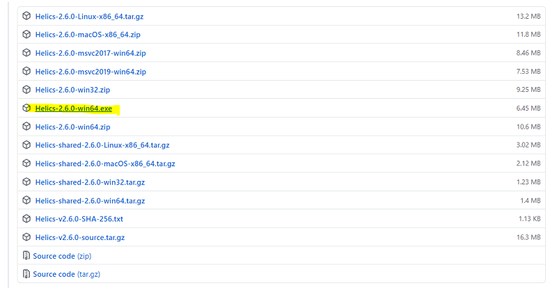

  There is a file with the .exe suffix like the highlighted file above. That will be your Windows Installer. Download it.

- After downloading the executable, run it.

  ** Windows may give you a warning but you may run it anyway. **

  Once you allow it to make changes, you will have the set up guide appear:

  

- Click through:

Next > I agree > Choose to add system variables if you would like > Next > Choose Destination folder for your install > Next > Choose Start Up Folder > Next > Keep all install components > Install

- This should install HELICS onto Windows and your folder directory should look somewhat like this:

  

  Inside the following folders (bin, lib, and include) you find this:

  - bin:

    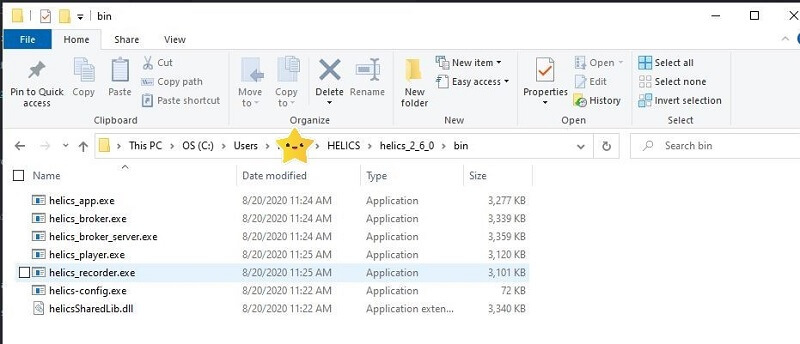

  - lib:

    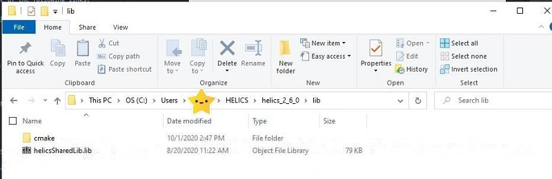

  - include:


** Keep track where the dynamic and static libraries are. We will need to know these locations to link it in Visual Studios! **

**2. Pull the HELICS example folder down from github**

```cmd
git clone https://github.com/GMLC-TDC/HELICS-Examples.git
```

- To navigate to the C hello_world example: -folder-HELICS-examples-downloaded-to-/c/hello_world.

It should look like this:


**3. Load the examples into Visual Studio**

Open up Visual Studio. We will do this twice since helics_world_sender.c and helics_world_receiver.c will need to be ran as two different executables.

We will first do this for helics_world_sender.c .

a. When you open up Visual Studio, there will be a welcome/get started pop up. You will see panel like this:


You will choose "Create a new project."

b. Choose "Empty Project"


Even though it says it is C++, we will be using this option and simply changing the suffix/extension.

c. Enter name the project with the file name without it's suffix (we will first do hello_world_sender):

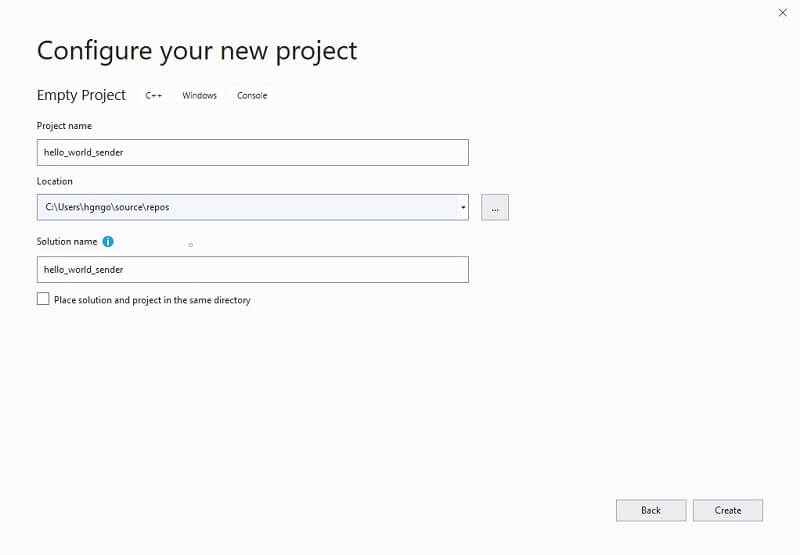

d. Choose "Create".

e. Repeat steps a-d except this time use the name hello_world_receiver.

Your "Configure your new project" screen should look like this:


f. Once both projects have been created, we will add their respective source files.

i. In Solution Explorer,

```txt
Right click hello_world_sender > Add > Existing item ...
```

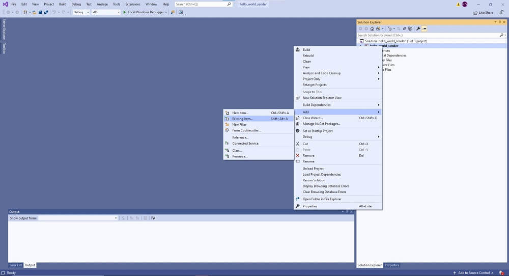

ii. Go to the location of where you pulled down the HELICS example:

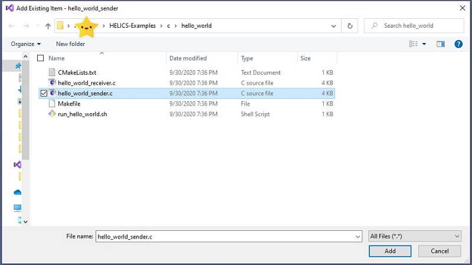

Click Add. You should see the hello-world_sender.c file appear in the Solutions Explorer under the Source Files.

Now do the same thing with hello_world_receiver.c in the hello_world_receiver Visual Studio project.

**4. Link HELICS in visual studios to run example**

a. Since we are using the HELICS installer, only the release version is attached. We need to make sure we're running on "Release" and "x64" settings. check that these are set in each tool bar of the projects:


b. Go to Project > Properties > C/C++ > All Options > Additional Include Directories > Down Arrow > Edit

This is where you will add the Include Directory of your HELICS installation. Check Step One (your path should end with include instead of helics, i.e. from the example it should be C:/Users/arbitraryfolder/HELICS/helics_2_6_0/include:


Click Ok > Apply. ** Do not exit out of Properties yet **

c. Go to Linker > All Options > scroll all the way up

i. Additional Dependencies > Down Arrow > Edit

This is where you will add the HELICS static library name: helicsSharedLib.lib

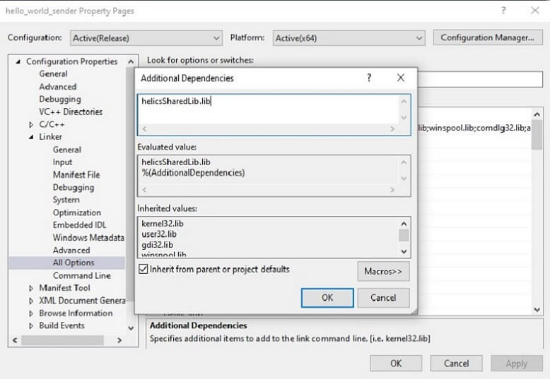

Click Ok > Apply. ** Do not exit out of Properties yet. Stay in Linker**

ii. Additional Library Directories > Down Arrow > Edit

This is where you will add the directories that hold the HELICS static and dynamic libraries, helicsSharedLib.lib and helicsSharedLib.dll, i.e. from example:

C:/Users/arbitraryfolder/HELICS/helics_2_6_0/bin

C:/Users/arbitraryfolder/HELICS/helics_2_6_0/lib

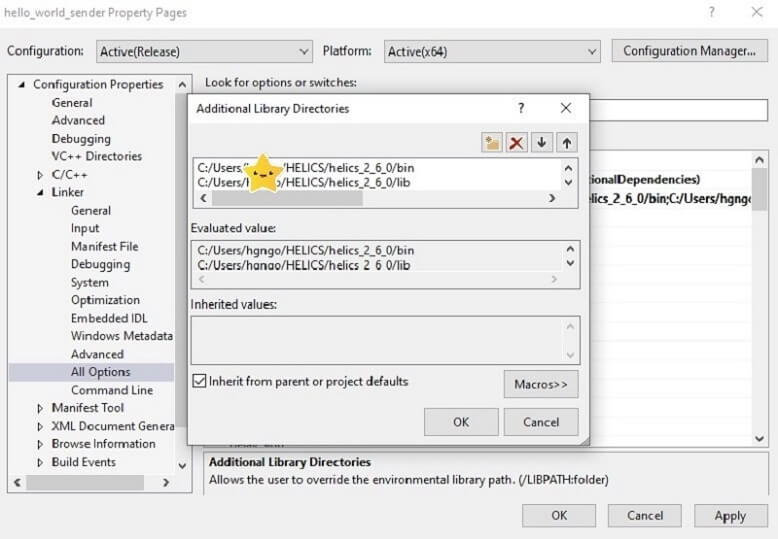

Click Ok > Apply > Ok (This will exit you out of Properties)

d. Go to ToolBar > Build > Build Solution

e. Once the solution is built, go to the Solution Explorer. You will go to the ToolBar and click on the folder/window icon next to the Home Icon. Once clicked the down arrow, you will either see

Folder View

- if you see this, you can just simply click Folder View and it'll switch you over to the Folder View

or

Two Options: .sln and project name with path

- if you see this, you will click the project name with the path

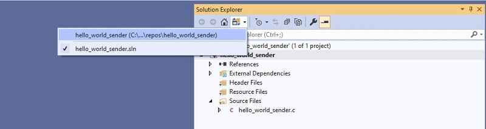

Here you see that there are two options.

Once you switch to Folder View or the option with the name + path, you will go to the Folder x64 > Release. You should be able to find the helics_world_sender.exe or the helics_world.receiver.exe file depending on which project you're looking at right now.

Here you will add the dynamic library. This is crucial part and cannot be missed or else we will have an error when we try to run the simulation.

i. Right Click on Release > Click Open Folder in File Explorer


ii. In another File Explorer, open up to your HELICS bin folder. You will find the helicsSharedLib.dll file. This will then be COPIED to the Release Folder that was just opened.

Before .dll file is copied over:

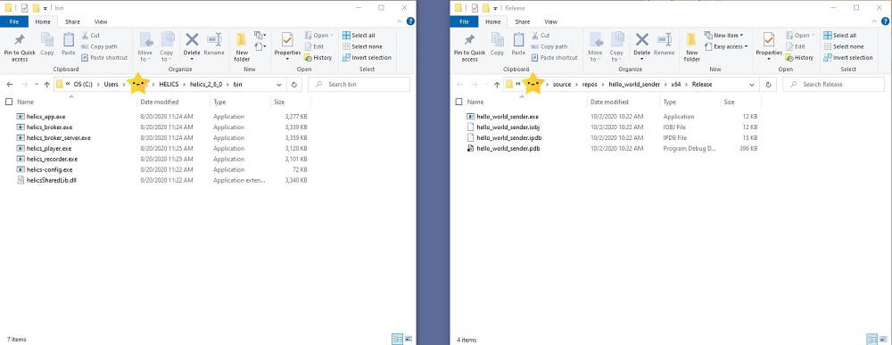

Copy the file over simply by

Click on the helicsSharedLib.dll in bin folder > Ctrl + c > Go over to Release folder > Ctrl + v

After .dll file is copied over:

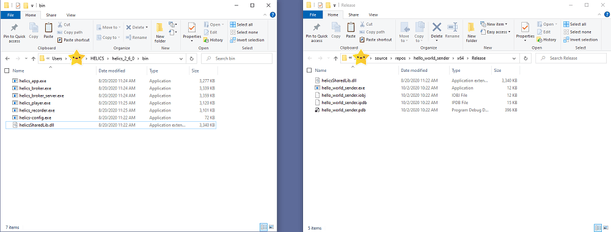

iii. Go back to Solutions View in order to run the solution (executable).

To do this, go back to Solution Explorer toolbar and click on folder/window icon next tot the Home Icon. Click the down arrow and choose option with .sln extension.

f. Once Solution is built, do steps a-e for other project (if you just did helics_world_sender, do helics_world_receiver, vice versa).

**5. Run the example**

To run the example we must have the broker running and also two of the solutions built into executables and ran.

The broker should be located in your HELICS bin folder.

a. Open a command prompt on windows, and go to the folder & run:

`helics_broker -f2`

This will tell the broker to expect two federates (helics_world_sender & helics_world_receiver).

- If there is a commError regarding zmq reply socket, it is because you are waiting too long to run the federates and the broker timed out.

b. Run helics_world_sender

`Click Green Play button 'Local Windows Debugger'`

** Microsoft Visual Studio Debug console should pop up **

c. Run helics_world_receiver

`Click Green Play button 'Local Windows Debugger'`

** Microsoft visual Studio Debug console should pop up **

This is how each prompt/console should look like after

broker, helics_world_sender, helics_world_receiver, respectively :

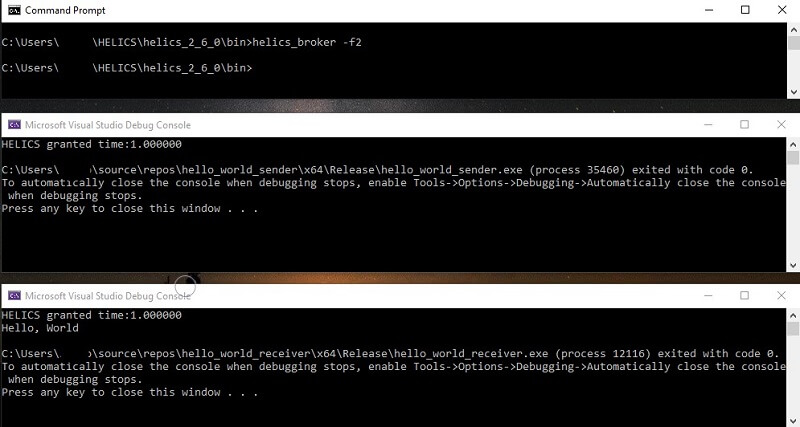

## Congratulations you ran your first HELICS simulation through Visual Studio!
