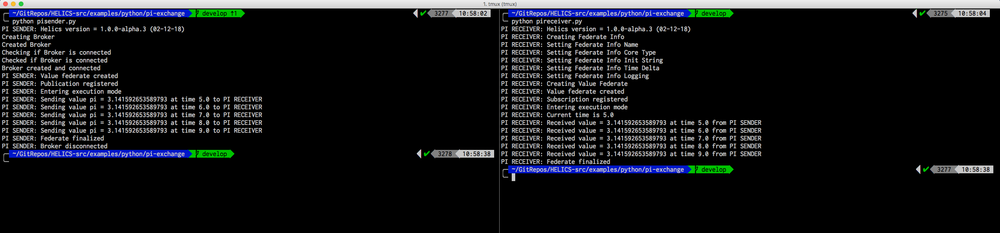

# Python Example

In the previous section, we covered the basics of a HELICS federate and how you can run multiple federates together to form a federation.
In this section we will look at how to create a federation in Python.
We will create a simple `pi-exchange` federation in Python with 2 federates.

**HELICS Python Setup**

Before we run the Python `pi-exchange` federation, it is necessary to ensure that we have Python installed and that we have the HELICS Python built successfully and correctly on the machine.

We recommend using pip with Python (version 2.7 or 3.5+) or Anaconda3/Miniconda3 to install a copy of the HELICS Python interface, although this should work with most versions of Python if you build the interface yourself using SWIG to generate the Python bindings to the `helicsSharedLib` shared library.
SWIG claims to be compatible with most Python versions, dating back to Python 2.0. And recommends that for the best results, one should consider using Python 2.3 or newer.

See the Installation instructions page for more information regarding this.

**Create a federations directory**

Linux and Mac:

```bash
$ mkdir -p ~/federations/pi-exchange
$ cd ~/federations/pi-exchange
```

Windows CMD:

```bash
> mkdir %USERPROFILE%\federations
> cd %USERPROFILE%\federations
> mkdir pi-exchange
> cd pi-exchange
```

**Writing the Python federation**

Next, make a new source file and call it `pisender.py`. Copy
the contents from
[pisender.py](https://github.com/GMLC-TDC/HELICS-Examples/blob/master/python/pi-exchange/pisender.py)
and paste it into the file.

Next, create a new source file and call it `pireceiver.py`.
Copy the contents from
[pireceiver.py](https://github.com/GMLC-TDC/HELICS-Examples/blob/master/python/pi-exchange/pireceiver.py)
and paste it into the file.

Save the files.

**Running a federation**

Linux and Mac:

Next, open two terminals. In the first terminal, run the following command.

```bash
$ python pisender.py
```

In a second terminal, run the following command.

```bash
$ python pireceiver.py
```

If done correctly, you should see an output like so:



You should see something like the following in the PI RECEIVER window (2nd one in directions above)

```bash
$ python pireceiver.py
PI RECEIVER: Helics version = x.x.x (XX-XX-XX)
PI RECEIVER: Creating Federate Info
PI RECEIVER: Setting Federate Info Name
PI RECEIVER: Setting Federate Info Core Type
PI RECEIVER: Setting Federate Info Init String
PI RECEIVER: Setting Federate Info Time Delta
PI RECEIVER: Setting Federate Info Logging
PI RECEIVER: Creating Value Federate
PI RECEIVER: Value federate created
PI RECEIVER: Subscription registered
PI RECEIVER: Entering execution mode
PI RECEIVER: Current time is 5.0
PI RECEIVER: Received value = 3.142857142857143 at time 5.0 from PI SENDER
PI RECEIVER: Received value = 3.142857142857143 at time 6.0 from PI SENDER
PI RECEIVER: Received value = 3.142857142857143 at time 7.0 from PI SENDER
PI RECEIVER: Received value = 3.142857142857143 at time 8.0 from PI SENDER
PI RECEIVER: Received value = 3.142857142857143 at time 9.0 from PI SENDER
PI RECEIVER: Federate finalized
end of master Object Holder destructor
```

Corresponding output should appear from the PI SENDER (window 1).

**Background:** Running a HELICS federation (via low level commands) requires first starting a helics broker and then running the desired set of federates with it. In this case, the pisender starts this broker and then joins as a federate.

**Tips**

Ensure that the install location is added to your `PATH`. If you've installed to the default system location, you may not need to do this.
To ensure that the Python extension works correctly, you may add the following to your `PYTHONPATH`. You can do so by pasting the following in your .bashrc file.

```bash
export PYTHONPATH="~/local/helics_install/python"
```
