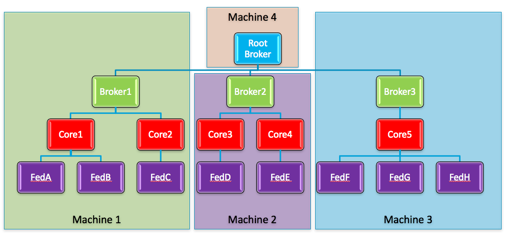

# Terminology

1.  Federate - An individual simulator that is computing something
    interesting and communicating with other simulators
2.  Core - An object managing the interactions of one or more Federates
3.  Broker - An object coordinating multiple cores or brokers

    - There can be several layers of brokers

4.  Root Broker – the top broker on the hierarchy

    - Last chance router
    - Responsible for determining when to enter initialization mode
      for the federation

5.  Federation – the set of all Federates executing together in a single
    co-simulation
6.  Interface - a structure by which a federate can communicate with other federates. Includes Endpoints, Publications, Filters, and Inputs

