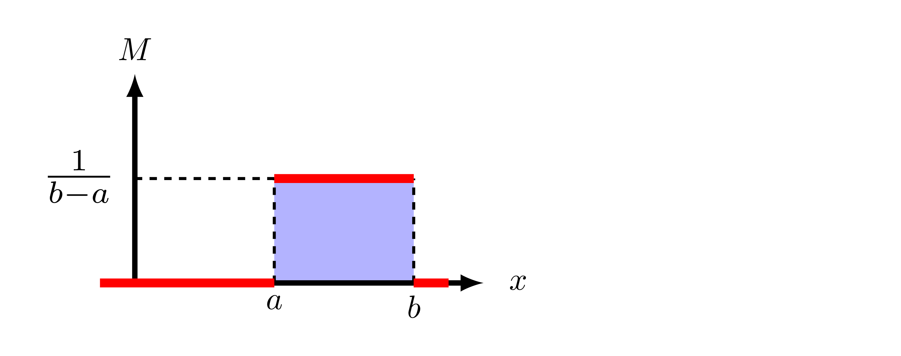

# Monte Carlo Simulations

```{eval-rst}
.. toctree::
    :maxdepth: 1

## Monte Carlo co-simulation

A Monte Carlo simulation allows a researcher to sample random numbers repeatedly from a predefined distribution to explore and quantify uncertainty in their analysis. Additional detail about Monte Carlo methods can be found on [Wikipedia](https://en.wikipedia.org/wiki/Monte_Carlo_method) and [MIT Open Courses](https://www.youtube.com/watch?v=OgO1gpXSUzU).

In a Monte Carlo co-simulation, a probability distribution of possible values can be used in the place of **any** static value in **any** of the simulators. For example, a co-simulation may include a simulator (federate) which measures the voltage across a distribution transformer. We can quantify measurement error by replacing the deterministic (static) value of the measurement with a random value from a uniform distribution. Probabilistic distributions are typically described with the following notation:

$$ M \sim U(a,b) $$

Where $M$ is the measured voltage, $a$ is the lower bound for possible values, and $b$ is the upper bound for possible values. This is read as, "$M$
is distributed uniformly with bounds $a$ and $b$."



The uniform distribution is among the most simple of probability distributions. Additional resources on probability and statistics are plentiful; [Statistical Rethinking](https://xcelab.net/rm/statistical-rethinking/) is highly recommended.
