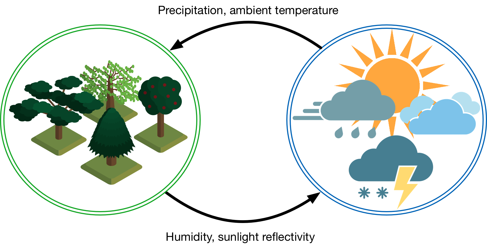

# Co-Simulation Overview

Co-simulation is an analysis technique that allows simulators from different domains to interact with each other, typically by exchanging values through the course of the simulation that define other simulators boundary conditions. For example, you may have a model and simulator that is able to describe atmospheric conditions and weather as they progress through time. You may have just found out about another well-established model and simulator that describes the growth of vegetation over large geographic areas. In reality, these two systems clearly interact with the precipitation and temperatures impacting the growth of vegetation and the amount of vegetation impacting air temperature and moisture content. These models, though, may treat this interaction as a boundary condition such that the atmospheric simulator assumes a fixed rate of sunlight reflection from the ground and the vegetation simulator uses a time-series historical precipitation values.

Co-simulation allows the coupling of existing models and simulators by breaking down these boundary condition barriers and calculating results that are more realistic and dynamic. In this case, while the atmospheric simulator is able to calculate the current weather using the latest values of surface reflectivity and humidity contributions from the vegetation, the vegetation simulator is able to use the latest values from the atmospheric simulator to determine the moisture content of the soil and the ambient temperature.

It's easy to imagine this hypothetical model being extended with other simulators throughout the ecosphere, incorporating models describing the behavior of the ocean, wildlife, even human agriculture. Rather than trying to build a single simulator that models all of this functionality, co-simulation allows us to use existing simulators that have the longer-term investment and validation behind them; that experience is leveraged into building simulations of complex systems of systems.

Co-simulation also has a built-in parallelism that allows it to be used to scale up to very large models. Particularly for systems with limited interactions between portions of the models, the value exchanges that take place during co-simulation are limited, allowing the individual instances of the simulators to run independently. Using our previous example, it is easy to imagine that there is limited to no interaction between vegetation in Oregon and vegetation in Texas (except through the atmosphere). Simulations of the vegetations in each of these states can run independently due to this lack of interaction, each providing values to the atmospheric model that indirectly couples them together. When able to be constructed in such a manner, the limitations on the size and complexity of the co-simulation become limited more by computing resources than by the capabilities of the individual simulators.

This being said, coupling these simulators together effectively can be summarized in the execution of two very related functions:

1. Maintaining synchronization of all the simulator instances running
2. Facilitating the data transfer between them

Maintaining synchronization is required when working in a heterogeneous simulation environment where each simulator's concept of time is different and the computation time required by each simulator instance can vary widely. Without the regulation of the universal co-simulation time, individual simulator instances could easily run ahead of the rest, simulating days and weeks ahead of the others.

And when one simulator instance is simulating one week ahead of the others, it becomes impossible for the results from that simulation to affect the rest of the simulator instances; the values it passes and receive are literally from a different point in time then the rest and are effectively meaningless. Without the synchronization of time, there is not way for the simulator instances to affect each other and without this interaction, the results of the co-simulation are meaningless.

HELICS, at its core, has been designed to do these two functions as efficiently, quickly, and comprehensively as possible to support a wide variety of simulators and models. Simulators with HELICS support have been modified in such a way so as to allow HELICS (really, a HELICS core object but we'll get to that in the [section on timing](./timing.md)) to advance the time of the simulator and provide it new values for specific variables that it is interested in. Making this modification to the simulator is not necessarily difficult but it must be done in such a way as to allow for these two fundamental functions to be executed.

Even after a simulator has been modified to support HELICS, users of that simulator who are building co-simulations have the task of constructing or designing a co-simulation to achieve the results they desire. Many simulators have thousands of potential values they can provide to other simulators and generally, most will not be needed by other simulators. It is the role of those designing the co-simulation to correctly configure each of the simulator instances such that the appropriate values are sent and received by the simulator instances and are mapped to the appropriate parameters inside each simulator. For a small number of simulators with a small number of values, this is not necessarily difficult but as the size of the co-simulation grows, this task becomes more challenging.
