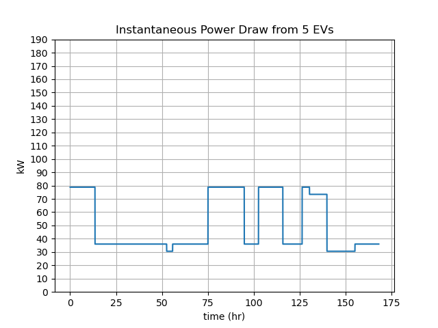

# Default Advanced Example


```eval_rst
.. toctree::
    :maxdepth: 1


```


The Advanced Base example walks through a HELICS co-simulation between three python federates, one of each type: value federate (`Battery.py`), message federate (`Controller.py`), and combination federate (`Charger.py`). This serves as the starting point for many of the other advanced examples and is an extension of the [Base Example.](../fundamental_examples/fundamental_default.md)

**TODO: insert updated graphic**
<p align="center">
	
</p>


**TODO: Update TOC**
The Advanced Base Example tutorial is organized as follows:

* [Example files](#example-files)  
* [What is this Co-simulation doing?](#what-is-this-co-simulation-doing)
  * [Differences as Compared to the Base Example](#differences-as-compared-to-the-base-example)
* [HELICS Components](#helics-components) 
  * [Register and Configure Federates](#register-and-configure-federates)
  * [Enter Execution Mode](#enter-execution-mode)
  * [Define Time Variables](#define-time-variables)
  * [Initiate Time Steps for the Time Loop](#initiate-time-steps-for-the-time-loop)
  * [Send Receive Communication between Federates](#send-receive-communication-between-federates)
* [Default Setup](#default-setup)
	* [Messages + Communication: pub sub](messages-+-communication-pub-sub)
	* [Simulator Integration: External JSON](#simulator-integration-external-json)
	* [Co-simulation Execution: `helics_cli`](#co-simulation-execution-helics_cli)
* [Questions and Help](#questions-and-help)


## Example files

All files necessary to run the Advanced Base Example can be found in the [Fundamental examples repository:](https://github.com/GMLC-TDC/HELICS-Examples/tree/master/user_guide_examples/advanced/advacned_default)

**TODO: Update screenshot of Github page for advanced example**
[](https://github.com/GMLC-TDC/HELICS-Examples/tree/master/user_guide_examples/fundamental/fundamental_default)

The files include:

* Python program and configuration JSON for Battery federate
* Python program and configuration JSON for Charger federate
* Python program and configuration JSON for Controller federate
* "runner" JSON to enable `helics_cli` execution of the co-simulation

## What is this Co-simulation doing?

This Advanced Base example is similar in theme to the [Base Example.](../fundamental_examples/fundamental_default.md) in that both are looking at power management for an EV charging garage. The implemented federates, though, are slightly more sophisticated and include a new centralized charging controller federate.

* **Battery.py** - Models a set of the EV batteries being charged. The EV is randomly assigned to support a particular charging level and receives an applied charging voltage based on that level. Using the applied voltage and the current SOC (initially randomly assigned), a charging current is calculated returned to the charger.
* **Charger.py** - Models a set of EV charging terminals all capable of supporting three defined charging levels:level 1, 2, and 3. Applies a charging voltage based on the charging terminal power rating and (imperfectly) measures the returned current. Based on this current, it estimates the SOC and sends that information to the controller. When commanded to terminate charging it removes the applied charging voltage.
* **Controller.py** - Receives periodic updates about the SOC of each charging vehicle and when they are considered close enough to full, command the charger to terminate charging.

Every time charging is terminated on an EV, a new EV to take its place is randomly assigned a supported charging level and initial SOC. 

### Differences as Compared to the Base Example

There are a few important distinctions between the Base Example and this example.

1. Both physical value exchanges and abstract information exchanges are modeled. The exchange of physical values takes place between the Battery and Charger federates. The message exchange (control signals, in this case) takes place between the Charger and Controller federates. For a further look at the difference between these two messaging mechanisms see our User Guide page on [value federates](../../fundamental_topics/value_federates.md) and [message federates.](../../fundamental_topics/message_federates.md)
2. The charger stops charging the battery by removing the charging voltage rather than the battery stopping the charging process. There is a slightly complicated process by which a new EV is synthesized when the existing EV is considered fully charged. The Battery federate synthesizes an EV battery.
3. The Controller federate has no regular update interval. The Controller works in pure abstract information and has no regular time steps to simulate. As such, it requests a maximum simulated time supported by HELICS (`HELICS_TIME_MAXTIME`) and makes sure it can be interrupted by setting `uninterruptable` to `false` in it's configuration file. Any time a message comes in for the Controller, HELICS grants it a time, the Controller performs the required calculation, sends out a new control signal, and requests `HELICS_TIME_MAXTIME` again.


Thinking back to the [Base Example.](../fundamental_examples/fundamental_default.md), a similar research question is being addressed by this co-simulation anlaysis: estimate calculate the **instantaneous power draw** from the EVs in the garage. And though you may have similar questions, there are two complicating changes in the new model:

1. The measurement of the charging current (used to calculate the actual charging power) has some noise built into it. This is modeled as random variation of the charging current in the federate itself and is a percentage of the charging current. The charging current decrease as the SOC of the battery increases leading to a noisier SOC estimate by the Charger federate at higher SOCs. This results in the Controller tending to terminate charging prematurely as a single sample of the noisy charging current can lead to over-estimate of the SOC.
2. Perhaps most interestingly, there are two SOC values modeled in this co-simulation. One could be considered the actual SOC of the battery and it is modeled in the Battery federate. The other is the estimate of the SOC as seen by the Charger federate. Both calculate the SOC in the same manner: calculate the effective resistive load of the battery, R and using a pre-defined relationship between R and SOC, calculate the SOC. In fact, you can see that both the Battery and Charger federates use the exact same relationship between SOC and effective R (SOC of zero is equivalent to an effective resistance of 8 ohms; SOC of 1 has an effective resistance of 150 ohms). Due to the noise in the charger current measurement, there is error built into its calculation of the SOC and therefore should be considered and estimate of the SOC.


This existence of two values for one property is not uncommon and is as much a feature as a bug. If this system were to be implemented in actual hardware, the only way that a charger would know the SOC of a battery would be through some kind of external measurement. And certainly there would be times where the charger would have even less information (such as the specific relationship between SOC and effective resistance) and would have to use historical data, heuristics, or smarter algorithms to know how to charge the battery effectively. Simulation allows us to use two separate models and thus independently model the actual SOC as known by the battery and the estimated SOC as calculated by the charger. 

**TODO: Talk about how a fully charged EV is replaced in the model**


## HELICS Components


### Controller federate timing
Again, the HELICS components (APIs) used in this example draw heavily from the [Base Example.](../fundamental_examples/fundamental_default.md). As was mentioned in the [differences when comparing to the Base Exampe](#differences-as-compared-to-the-base-example), the Controller federate requests `HELICS_TIME_MAXTIME` (effectively infinite time) and only updates when a new message arrives for it to process:

**TODO: Get rid of fake_max_time**

```
 		hours = 24*7 # one week
    	total_interval = int(60 * 60 * hours)
    	grantedtime = 0
    	fake_max_time = int(h.HELICS_TIME_MAXTIME/1000)
    	starttime = fake_max_time
    	logger.debug(f'Requesting initial time {starttime}')
    	grantedtime = h.helicsFederateRequestTime (fed, starttime)
    	logger.debug(f'Granted time {grantedtime}')

```


### Initial time requests and model initialization

As in the [Base Example.](../fundamental_examples/fundamental_default.md), the EV batteries are assumed connected to the chargers at the beginning of the simulation and information exchange is initiated by the Charger federate sending the charging voltage to the Battery federate. In this model, this is a convenient choice as the charging voltage is constant and thus is never a function of the charging current. In a more realistic model, it's easy to imagine that the charger has an algorithm that adjusts the charging voltage based on the charging current to, say, ensure the battery is charged at a particular power level. In that case, the dependency of the models is circular; this is common. 

If the early time steps of the simulation are not as important (a model warm up period), then ensuring each federate has a default value it will provide when the input is null (and assuming the controller dynamics are not overly aggressive) will allow the models to bootstrap and through several iterations reach a consistent state. If this is not the case then HELICS does have a provision for getting models into a consistent state prior to the start of execution: initialization mode. **TODO: link to documentation or example on initialization mode.**  This mode allows for this same iteration between models with no simulated time passing. It is the responsibility of the modeler to make sure there is a method to reach and detect convergence of the models and when such conditions are met, enter execution mode as would normally be done.


## Co-simulation Setup

### Messages + Values
As you may or may not have read in the User Guide (**TODO: link to appropriate section in User Guide**), one of the key differences between value exchange and the message exchange is that value exchange paths are defined once the federation has been initialized but message exchanges are dynamic and can travel from any endpoint to any endpoint throughout the co-simulation. The diagram below shows the three federates used in this example with the representative handles for both the value and message exchanges.


**TODO: create and insert graphic for example signal topology**


### Co-simulation Execution and Results
As in the [Base Example.](../fundamental_examples/fundamental_default.md), `helics_cli` is used to launch the co-simulation:

```
> helics run --path=advanced_default_runner.json
```


This is the view of each battery as it is charged and two things are immediately obvious:

1. The impact of the charging level is pronounced. The first Batt1 takes almost half the simulation to charge but when its replacement is placed on the charger, it starts at a similar SOC but charges in a fraction of the time. The impact of the charging power supported by each EV is significant.
2. Most of the batteries fail to reach 100% SOC, some dramatically so. This is due to the current measurement error leading to a mis-estimate of SOC and thus premature termination of the charging. This can be seen the following graph


As previously mentioned, the current measurement noise is a function of the total magnitude of the current and thus as the battery charges up and the current draw drops, the noise in the measurement becomes a bigger fraction of the overall value. This results in the noisiest SOC estimates at higher SOC values. This is clearly seen in the EV1 value that starts the co-simulation relatively smooth and steadily increases in noisiness. 

This graph also clearly shows that each EV was estimated to have a 100% SOC when the charging was terminated even though we know from the previous graph that full charge had not been reached.




The data shown in the power graph is arguably the point of the analysis. It shows our maximum charging power for this simulated time as 80 kW. If this is the only simulation result we have, we would be inclined to use this as a design value for our electricity delivery infrastructure. More nuanced views could be had, though, by:

1. Running this co-simulation multiple times using a different random seed to see if 80 kW is truly the maximum power draw
2. Plotting the charging power as a histogram to get a better understanding of the distribution of the instantaneous charging power.
3. **TODO: Any others? I think we should foreshadow the orchestration example.**


## [Questions and Help](../support.md)

Do you have questions about HELICS or need help?  

1. Come to [office hours](mailto:helicsteam@helics.org)!
2. Post on the [gitter](https://gitter.im/GMLC-TDC/HELICS)!
3. Place your question on the [github forum](https://github.com/GMLC-TDC/HELICS/discussions)!

