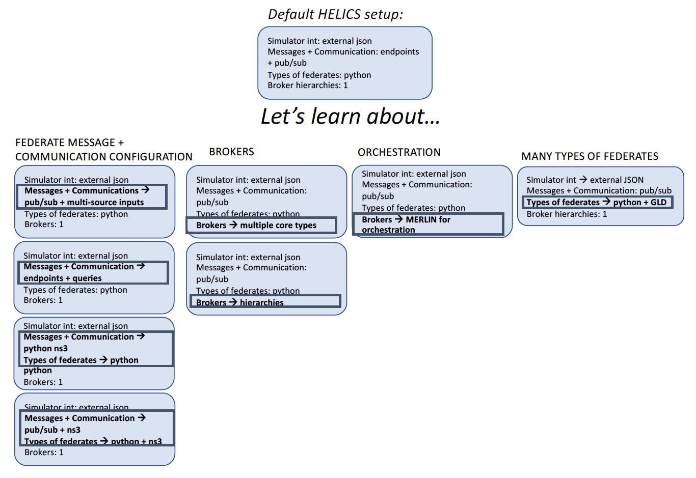
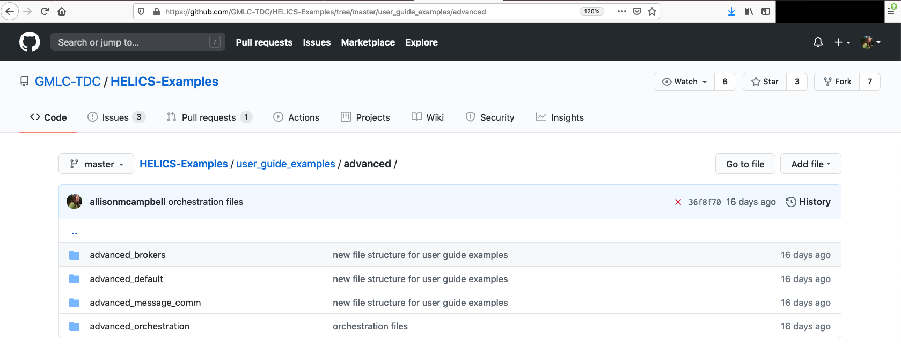

# Advanced Examples


```eval_rst
.. toctree::
    :maxdepth: 1
    
    advanced_default
    advanced_communication
    advanced_brokers
    advanced_orchestration
    advanced_manyfeds
    advanced_final

```


The Fundamental examples teach three concepts to build on a default setup:

1. Federate Integration with the API
2. Message and Communication Configuration
3. Integrating multiple concepts





## What are we modeling?


## Where is the code?

The code for the [Advanced examples](https://github.com/GMLC-TDC/HELICS-Examples/tree/master/user_guide_examples/advanced) can be found in the HELICS-Examples repository on github. If you have issues navigating to the examples, visit the HELICS gitter page or the user forum on github.

[](https://github.com/GMLC-TDC/HELICS-Examples/tree/master/user_guide_examples/advanced)

