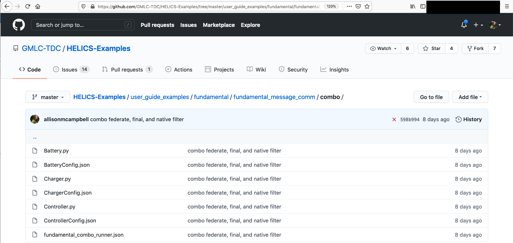
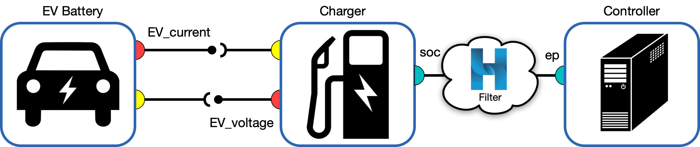

# Combination Federation

The Federate Message + Communication Configuration Example extends the Base Example to demonstrate how to register federates which can send/receive messages from endpoints and values from pub/subs. This example assumes the user has already worked through the [Endpoints Example](./fundamental_endpoints.md).

This tutorial is organized as follows:

* [Example files](#example-files)  
* [Combination Federation](#combination-federation)
	* [When to use pub/subs vs endpoints](#when-to-use-pub-subs-vs-endpoints)
	* [Translation from pub/sub to endpoints](#translation-from-pub-sub-to-endpoints)
	* [Co-simulation Execution](co-simulation-execution)
* [Questions and Help](#questions-and-help)

## Example files

All files necessary to run the Federate Integration Example can be found in the [Fundamental examples repository:](https://github.com/GMLC-TDC/HELICS-Examples/tree/master/user_guide_examples/fundamental/fundamental_message_comm/combo)

* Python program and configuration JSON for Battery federate
* Python program and configuration JSON for Charger federate
* Python program and configuration JSON for Controller federate
* "runner" JSON to enable `helics_cli` execution of the co-simulation

## Combination Federation

A quick glance at the [Fundamental examples repository](https://github.com/GMLC-TDC/HELICS-Examples/tree/master/user_guide_examples/fundamental/) on github will show that almost all these introductory examples are mocked up with two federates. These two federates pass information back and forth, and the examples show different ways this can be done. 

This is the only example in the Fundamental series which models three federates -- it is also exactly the same model as the [Base Example](../advanced_examples/advanced_default.md) in the Advanced series. Why are we introducing a third federate?

In the [Endpoints Example](./fundamental_endpoints.md), we learned how to pass messages between two federates. The problem with this setup -- which we will resolve in this example -- is that **physical values** should not be modeled with messages/endpoints (see [the example](./fundamental_endpoints.md#federate-communication-with-endpoints) for a reminder). We introduce a third federate -- a **combination federate** -- to preserve the handling of physical values among *value federates* and allow for nuanced message passing (and interruption) among *message federates*. The key with combo federates is that they are the go-between for these two types. Combination federates can update (send) values *and* intercept messages. (For a refresher on values and messages, see the section on [Types of Federates](../../fundamental_topics/federates.html). In brief: values have a physics-based unit, and messages are typically strings).
  
Here is our new federation of three federates:

We have:

* Battery (**value federate**: passes values with Charger through pub/subs)
* Charger (**combo federate**: passes values with Battery, passes messages with Controller)
* Controller (**message federate**: passes messages with Charger through endpoints)

### What is each federate doing?

The full co-simulation is still asking the same question: "What is the expected instantaneous power draw from a dedicated EV charging garage?" With the introduction of a *Controller* federate, we now have additional flexibility in addressing the nuances to this question. For example, the charging controller does not have direct knowledge of the instantaneous current in the battery -- the onboard charger needs to estimate this in order to calculate the EV's state of charge. Let's walk through the roles of each federate.

#### Battery

#### Charger

#### Controller

### Translation from pub/sub to endpoints

### Co-simulation execution

## [Questions and Help](../support.md)

Do you have questions about HELICS or need help?  

1. Come to [office hours](mailto:helicsteam@helics.org)!
2. Post on the [gitter](https://gitter.im/GMLC-TDC/HELICS)!
3. Place your question on the [github forum](https://github.com/GMLC-TDC/HELICS/discussions)!
