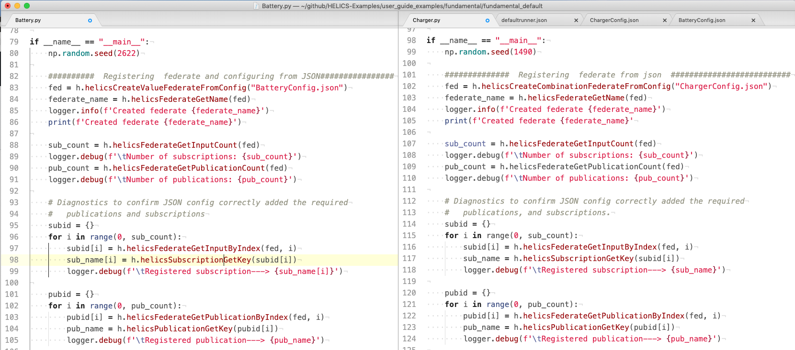
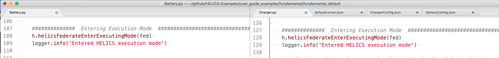
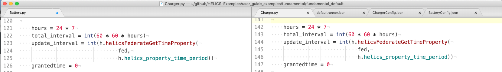
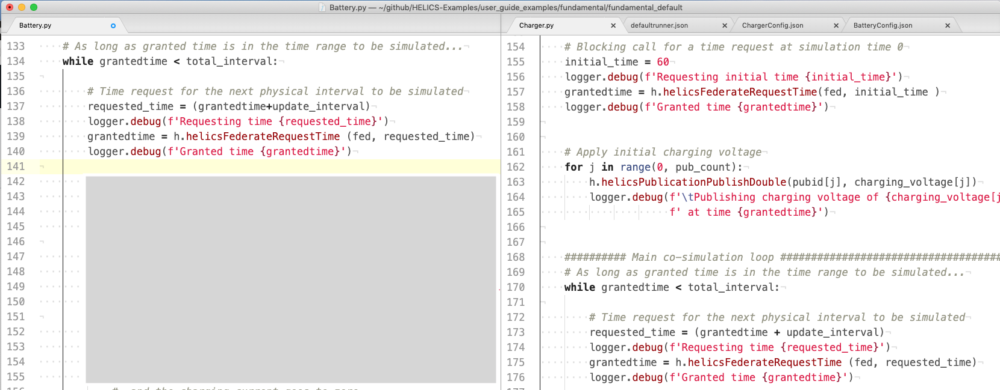
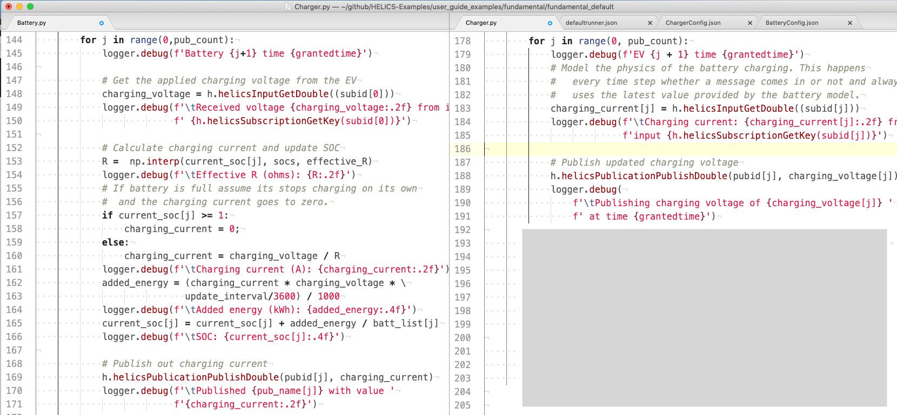
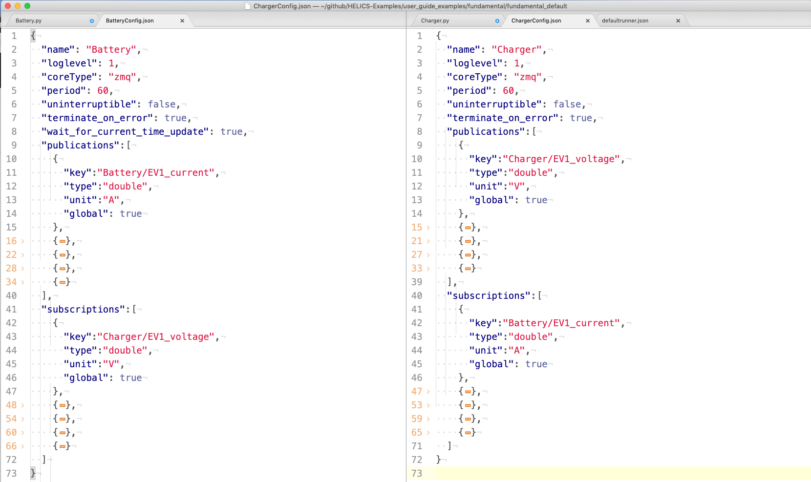

# Base Example Co-Simulation


The Base Example walks through a simple HELICS co-simulation between two python federates. This example also serves as the recommended defaults for setting up a co-simulation.

<p align="center">

</p>

The base example described here will go into detail about the necessary components of a HELICS program. Subsequent examples in the Fundamental Examples section will change small components of the system.

The Base Example tutorial is organized as follows:

```eval_rst
.. toctree::
    :maxdepth: 1
    

    
```


## Example files

All files necessary to run the Base Example can be found in the [Fundamental examples repository:](https://github.com/GMLC-TDC/HELICS-Examples/tree/master/user_guide_examples/fundamental/fundamental_default)

[](https://github.com/GMLC-TDC/HELICS-Examples/tree/master/user_guide_examples/fundamental/fundamental_default)

The files include:

* Python program and configuration json for Battery federate
* Python program and configuration json for Charger federate
* "runner" json to enable `helics_cli` execution

## What is this Co-simulation doing?

Describe the purpose of the program -- what is it calculating?

## HELICS Components

What are the necessary components to a basic co-simulation?

### Register and Configure Federates



### Enter Execution Mode



### Define Time Variables



### Initiate Time Steps



* request time, grant time

### Send/Receive Communication between Federates




## Default Setup

The default setup integrates the federates configurations with external JSON files. The message and communication configurations are publications and subscriptions.

### Simulator Integration: External JSON



- picture of jsons
- where they integrate in the cosim

### Messages + Communication: pub/sub


### Co-simulation Execution: `helics_cli`

- picture of runner json
- link to helics_cli page
- picture of running on the command line
- picture of output files


