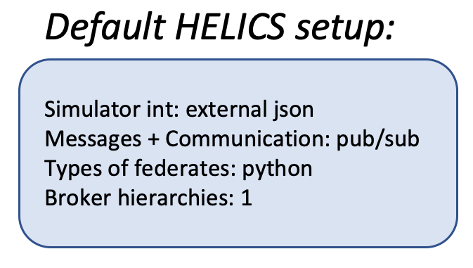
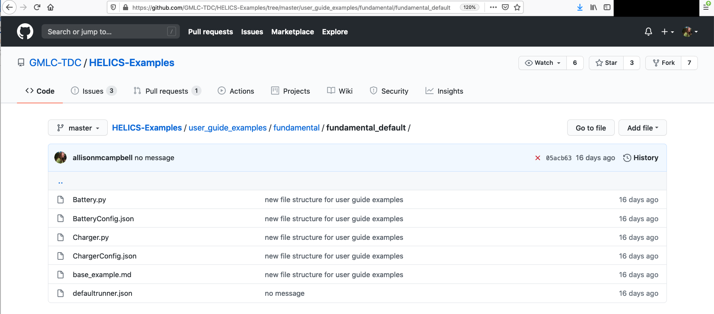
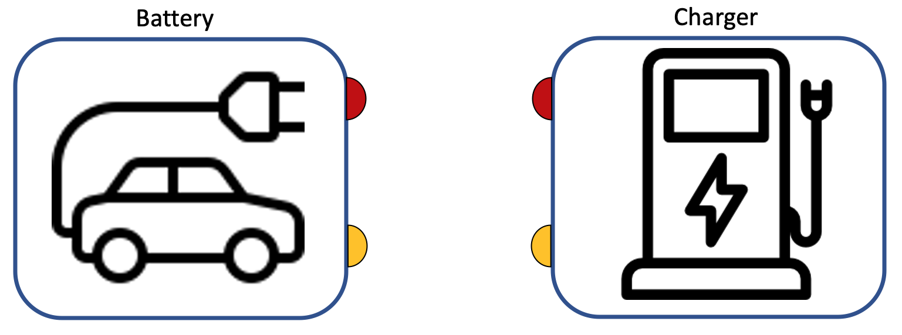
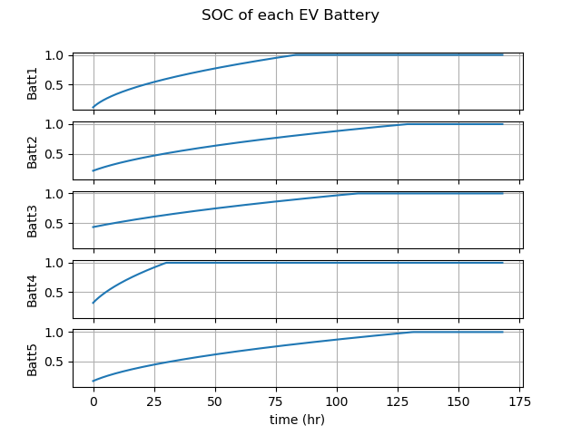
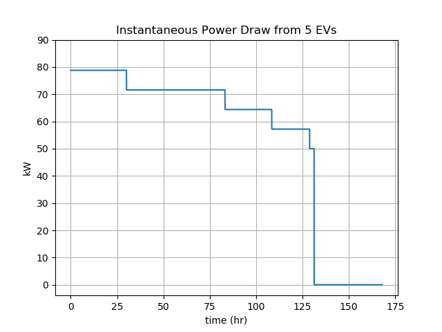

# Base Example Co-Simulation


The Base Example walks through a simple HELICS co-simulation between two python federates. This example also serves as the recommended defaults for setting up a co-simulation.

```eval_rst
.. raw:: html

	<p align="center">
	
	</p>
	
```

The base example described here will go into detail about the necessary components of a HELICS program. Subsequent examples in the Fundamental Examples section will change small components of the system.

The Base Example tutorial is organized as follows:

```eval_rst
.. contents::
	:local:    
    
```


## Example files

All files necessary to run the Base Example can be found in the [Fundamental examples repository:](https://github.com/GMLC-TDC/HELICS-Examples/tree/master/user_guide_examples/fundamental/fundamental_default)

[](https://github.com/GMLC-TDC/HELICS-Examples/tree/master/user_guide_examples/fundamental/fundamental_default)

The files include:

* Python program and configuration JSON for Battery federate
* Python program and configuration JSON for Charger federate
* "runner" json to enable `helics_cli` execution of the co-simulation

## What is this Co-simulation doing?

This Base Example is modeling the interaction between five electric vehicles (EVs) each connected to a charging station -- five EVs, five charging stations. You can imagine that five EVs enter a parking garage filled with charging stations (charging garage). We will be modeling the EVs as if they are solely their on-board batteries.

Imagine you are the engineer assigned to assess how much power will be needed to serve EVs in this charging garage. The goal of the co-simulation is to calculate the **instantaneous power draw** from the EVs in the garage.

Some questions you might ask yourself include:

1. How many EVs are likely to be charging at any given time?
2. What is the charge rate (power draw limitation) for these EVs?
3. What is the battery size (total capacity) for these EVs?

For now, we've decided that there will always be five EVs and five charging stations. We can also define a few functions to assign the charge rates and the battery sizes. This requires some thinking about *which* federate will manage *what* information. 

The co-simulation has two federates: one for the EVs, and one for the Chargers. The batteries on board the EVs will remain the domain of the EVs and inform the EV state of charge (SOC). The Chargers will manage the voltage applied to the EV batteries, and will retain knowledge of the rate of charge.

Within the federate `Battery.py`, EV battery sizes can be generated using the function `get_new_battery`:

```
def get_new_battery(numBattery):
    # Probabilities of a new EV battery having small capacity (lvl1),
    # medium capacity (lvl2), and large capacity (lvl3).
    lvl1 = 0.2
    lvl2 = 0.2
    lvl3 = 0.6

    # Batteries have different sizes:
    # [25,62,100]
    listOfBatts = np.random.choice([25,62,100],numBattery,p=[lvl1,lvl2,
                                                       lvl3]).tolist()
    return listOfBatts
```

Within the federate `Charger.py`, the charge rate for each EV is generated using the function `get_new_EV`:

```
def get_new_EV(numEVs):
    # Probabilities of a new EV charging at the specified level.
    lvl1 = 0.05
    lvl2 = 0.6
    lvl3 = 0.35
    listOfEVs = np.random.choice([1,2,3],numEVs,p=[lvl1,lvl2,lvl3]).tolist()
    numLvl1 = listOfEVs.count(1)
    numLvl2 = listOfEVs.count(2)
    numLvl3 = listOfEVs.count(3)

    return numLvl1,numLvl2,numLvl3,listOfEVs
```

The probabilities assigned to each of these functions are placeholders -- a more advanced application can be found in the [Orchestration Tutorial](../advanced/orchestration_monte_carlo.md).

Now that we know these three quantities -- the number of EVs, the capacity of their batteries, and their charge rates, we can build a co-simulation from the two federates. The `Battery.py` federate will update the SOC of each EV after it receives the voltage from the `Charger.py` federate. The `Charger.py` federate will send a voltage signal to the EV until it tells the Charger it has reached its full capacity.

The `Battery.py` federate can tell us the SOC of each EV throughout the co-simulation, and the `Charger.py` federate can tell us the aggregate power draw from all the EVs throughout the co-simulation. The co-simulation will be run for one week.

## HELICS Components

We know conceptually what we want to (co-)simulate. What are the necessary HELICS components to knit these two federates into one co-simulation?

### Register and Configure Federates

The first task is to register and configure the federates with HELICS within each python program:

```
    ##########  Registering  federate and configuring from JSON################
    fed = h.helicsCreateValueFederateFromConfig("BatteryConfig.json")
    federate_name = h.helicsFederateGetName(fed)
    logger.info(f'Created federate {federate_name}')
    print(f'Created federate {federate_name}')

```

Since we are configuring with external JSON files, this is done in one line! 


### Enter Execution Mode

The HELICS co-simulation starts by instructing each federate to enter execution mode.

```
    ##############  Entering Execution Mode  ##################################
    h.helicsFederateEnterExecutingMode(fed)
    logger.info('Entered HELICS execution mode')

```


### Define Time Variables

Time management is a vital component to HELICS co-simulations. Every HELICS co-simulation needs to be provided information about the start time (`grantedtime`), the end time (`total_interval`) and the time step (`update_interval`). Federates can step through time at different rates [LINK TO TIME MD], and it is allowable to have federates start and stop at different times, but this must be curated to meet the needs of the research question.


```
    hours = 24 * 7
    total_interval = int(60 * 60 * hours)
    update_interval = int(h.helicsFederateGetTimeProperty(
                                fed,
                                h.helics_property_time_period))
    grantedtime = 0

```


### Initiate Time Steps for the Time Loop

Starting the co-simulation time sequence is also a function of the needs of the research question. In the Base Example, the EVs will already be "connected" to the Chargers and will be waiting for the voltage signal from the Charger. This means we need to set up a signal to send from the Charger to the EV *before* the EV requests the signal.

In the `Battery.py` federate, Time is initiated by starting a `while` loop and requesting the first time stamp:

```
    while grantedtime < total_interval:
    
        # Time request for the next physical interval to be simulated
        requested_time = (grantedtime+update_interval)
        logger.debug(f'Requesting time {requested_time}')
        grantedtime = h.helicsFederateRequestTime (fed, requested_time)
        logger.debug(f'Granted time {grantedtime}')
```

In the `Charger.py` federate, we need to send the first signal **before** entering the time `while` loop. This is accomplished by requesting an initial time (outside the `while` loop), sending the signal, and then starting the time `while` loop:

```
    # Blocking call for a time request at simulation time 0
    initial_time = 60
    logger.debug(f'Requesting initial time {initial_time}')
    grantedtime = h.helicsFederateRequestTime(fed, initial_time )
    logger.debug(f'Granted time {grantedtime}')


    # Apply initial charging voltage
    for j in range(0, pub_count):
        h.helicsPublicationPublishDouble(pubid[j], charging_voltage[j])
        logger.debug(f'\tPublishing charging voltage of {charging_voltage[j]} '
                     f' at time {grantedtime}')


    ########## Main co-simulation loop ########################################
    # As long as granted time is in the time range to be simulated...
    while grantedtime < total_interval:

        # Time request for the next physical interval to be simulated
        requested_time = (grantedtime + update_interval)
        logger.debug(f'Requesting time {requested_time}')
        grantedtime = h.helicsFederateRequestTime (fed, requested_time)
        logger.debug(f'Granted time {grantedtime}')

```


### Send/Receive Communication between Federates

Once inside the time loop, information is requested and sent between federates at each time step. In the Base Example, the federates first request information from the handles to which they have subscribed, and then send information from the handles from which they publish.

The `Battery.py` federate first asks for voltage information from the handles to which it subscribes:

```
            # Get the applied charging voltage from the EV
            charging_voltage = h.helicsInputGetDouble((subid[0]))
            logger.debug(f'\tReceived voltage {charging_voltage:.2f} from input'
                         f' {h.helicsSubscriptionGetKey(subid[0])}')
```

And then (after doing some internal calculations) publishes the charging current of the battery at its publication handle:

```
            # Publish out charging current
            h.helicsPublicationPublishDouble(pubid[j], charging_current)
            logger.debug(f'\tPublished {pub_name[j]} with value '
                         f'{charging_current:.2f}')
```

Meanwhile, the `Charger.py` federate asks for charging current from the handles to which it subscribes:

```
            charging_current[j] = h.helicsInputGetDouble((subid[j]))
            logger.debug(f'\tCharging current: {charging_current[j]:.2f} from '
                         f'input {h.helicsSubscriptionGetKey(subid[j])}')

```

And publishes the charging voltage at its publication handle:

```
            # Publish updated charging voltage
            h.helicsPublicationPublishDouble(pubid[j], charging_voltage[j])
            logger.debug(
                f'\tPublishing charging voltage of {charging_voltage[j]} '
                f' at time {grantedtime}')
```


## Default Setup

The default setup, used in the Base Example, integrates the federate configurations with external JSON files. The message and communication configurations are publications and subscriptions. We recommend launching the co-simulation with [`helics_cli`](link to helics cli md). This section explains how information is passed between publications and subscriptions, how to configure the federates with JSONs, and how to launch the co-simulation with `helics_cli`.

### Messages + Communication: pub/sub

In the Base Example, the information being passed between the `Battery.py` federate and the `Charger.py` federate is the **voltage** applied to the battery, and the **current** measured across the battery and fed back to the charger. Voltage and current are both physical quantities, meaning that unless we act on these quantities to change them, they will retain their values. For this reason, in HELICS physical quantities are called **values**. Values are sent via publication and subscription -- a federate can publish its value(s), and another federate can subscribe this value(s).

When configuring the communication passage between federates, it is important to connect the federate to the correct **handle**. In the image below, we have a Battery federate and a Charger federate. Each federate has a **publication** handle  (red) and a **subscription** handle (yellow). How are values passed between federates with pubs and subs?



We have named the publication handle for the `Battery` federate `EV_current` to indicate the information being broadcast. This is what the publication is doing -- we are telling the Battery federate that we want to publish the EV_current. The full handle for the current is `Battery/EV_current` (within the JSON, this is also called the `key`).


How does the current value get from the Battery federate's publication to the Charger federate? The Charger must subscribe to this publication handle -- the Charger will subscribe to `Battery/EV_current`.


Thus far we have established that the Battery is publishing its current from handle `Battery/EV_current` and the Charger is subscribing to this handle. The Charger is also sending information about values. The Charger federate will be publishing the voltage value from the `Charger/EV_voltage` handle.


In order to guarantee that the Battery federate receives the voltage value from the Charger federate, the Battery needs to subscribe to the `Charger/EV_voltage` handle.

 **try gitter**

The final configuration for one EV is shown in the image below. Federates subscribe to the handle which is publishing the value they need to perform the analysis.


### Simulator Integration: External JSON

Configuration of federates may be done with JSON files. Each federate will have its own configuration ("config") file. It's good practice to mirror the name of the federate with the config file. For example, the `Battery.py` federate will have a config file named `BatteryConfig.json`. 

There are (extensive ways)[link to config page] to configure federates in HELICS. The `BatteryConfig.json` file contains the most common as defaults:

```
{
  "name": "Battery",
  "loglevel": 1,
  "coreType": "zmq",
  "period": 60,
  "uninterruptible": false,
  "terminate_on_error": true,
  "wait_for_current_time_update": true,
  "publications":[ ... ],
  "subscriptions":[ ... ]
  }

```

In this configuration, we have named the federate `Battery`, set the `loglevel` to 1 ([what do loglevels mean and which one do I want?](../configuration_options_reference.html#logging-options)), and set the `coreType` to `zmq` ([the most common](../advanced_topics/CoreTypes.md)). The next four options control timing for this federate. The final options are for message passing.

This federate is configured with pubs and subs, so it will need an option to indicate the publication and the subscription configurations (for brevity, only the first pub and sub are printed below):

```
  "publications":[
    {
      "key":"Battery/EV1_current",
      "type":"double",
      "unit":"A",
      "global": true
    },
    {...}
    ],
  "subscriptions":[
    {
      "key":"Charger/EV1_voltage",
      "type":"double",
      "unit":"V",
      "global": true
    },
    {...}
    ]
```

This pub and sub configuration is telling us that the `Battery.py` federate is publishing in units of amps (`A`) for current from the handle (`key`) `Battery/EV1_current`. This federate is also subscribing to information from the `Charger.py` federate. It has subscribed to a value in units of volts (`V`) at the handle (`key`) `Charger/EV1_voltage`.

As discussed in [Section about Register and Configure Federates], the federate registration and configuration with JSON files in the python federate is done with one line of code:
```
fed = h.helicsCreateValueFederateFromConfig("BatteryConfig.json")
```

Recall that federate registration and configuration is typically done **before** entering execution mode.

(can you create a new configuration after entering execution mode?)


### Co-simulation Execution: `helics_cli`

At this point in setting up the Base Example co-simulation, we have:

1. Placed the necessary HELICS components in each federate program
2. Written the configuration JSON files for each federate

It's now time to launch the co-simulation with `helics_cli` ([install helics_cli here!](https://github.com/GMLC-TDC/helics-cli)). This is accomplished by creating a **runner** JSON file. `helics_cli` allows the user to launch multiple simulations in one command line, which otherwise would have required multiple terminals.

The runner JSON for the Base Example is called `EVtoyrunner.json`:

```
{
  "federates": [
    {
      "directory": ".",
      "exec": "helics_broker -f 2 --loglevel=7",
      "host": "localhost",
      "name": "broker"
    },
    {
      "directory": ".",
      "exec": "python -u Charger.py 1",
      "host": "localhost",
      "name": "Charger"
    },
    {
      "directory": ".",
      "exec": "python -u Battery.py 1",
      "host": "localhost",
      "name": "Battery"
    }
  ],
  "name": "EV_toy"
}
``` 

This runner tells `helics_broker` that there are three federates and to take a specific action for each federate:

1. Launch `helics_broker` in the current directory: `helics_broker -f 2 --loglevel=7`
2. Launch the `Charger.py` federate in the current directory: `python -u Charger.py 1`
3. Launch the `Battery.py` federate in the current directory: `python -u Battery.py 1`

The final step is to launch our Base Example with `helics_cli` from the command line:

```
>helics run --path=EVtoyrunner.json
```

If all goes well, this will reward us with two figures:




We can see the state of charge of each battery over the duration of the co-simulation in the first figure, and the aggregated instantaneous power draw in the second. As the engineer tasked with assessing the power needs for this charging garage, do you think you have enough information at this stage? If not, how would you change the co-simulation to better model the research needs?

## [Questions and Help](../support.md)

Do you have questions about HELICS or need help?  

1. Come to [office hours](mailto:helicsteam@helics.org)!
2. Post on the [gitter](https://gitter.im/GMLC-TDC/HELICS)!
3. Place your question on the [github forum](https://github.com/GMLC-TDC/HELICS/discussions)!

