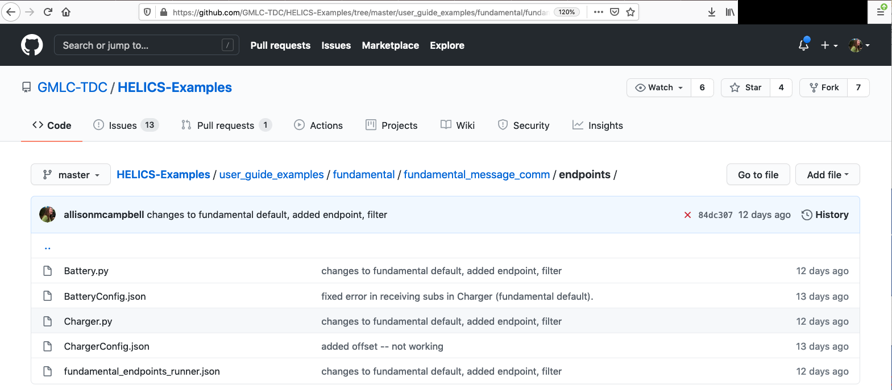
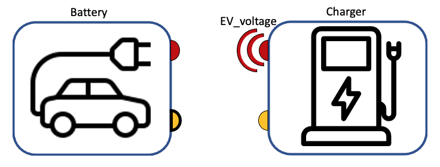
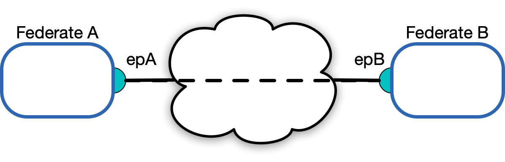

# Endpoint Federates

The Federate Message + Communication Configuration Example extends the Base Example to demonstrate how to register federates which send messages from/to endpoints instead of values from/to pub/subs.

This tutorial is organized as follows:

* [Example files](#example-files)  
* [Federate Communication with Endpoints](#federate-communication-with-endpoints)
	* [When to use pub/subs vs endpoints](#when-to-use-pub-subs-vs-endpoints)
	* [Translation from pub/sub to endpoints](#translation-from-pub-sub-to-endpoints)
		* [Config Files](#config-files)
		* [Simulators](#simulators)
	* [Co-simulation Execution](co-simulation-execution)
* [Questions and Help](#questions-and-help)


## Example files

All files necessary to run the Federate Integration Example can be found in the [Fundamental examples repository:](https://github.com/GMLC-TDC/HELICS-Examples/tree/master/user_guide_examples/fundamental/fundamental_integration)

[](https://github.com/GMLC-TDC/HELICS-Examples/tree/master/user_guide_examples/fundamental/fundamental_message_comm/endpoints)

The files include:

* Python program and configuration JSON for Battery federate
* Python program and configuration JSON for Charger federate
* "runner" JSON to enable `helics_cli` execution of the co-simulation

## Federate Communication with Endpoints

There are two fundamental cases where you may find yourself using endpoints to send messages.

1. The federate is modeling communication of information (typically as a string)
2. The federate is incorrectly modeling communication of physical dynamics

What's the difference? In the [Base Example](./fundamental_default.md), the federation consists of two "value" federates -- one passes its current, the other passes a voltage. The two depend on this information. The Battery says to the Charging port, "I have a starting current!", to which the Charger responds, "Great, here's your voltage!" These two **value** federates must be coupled with pubs/subs, because they are linked by a physical system.

However, as the author of a HELICS co-simulation, there is nothing preventing you from connecting these two federates with endpoints in place of pub/subs. The co-simulation will give the same results in simple cases, but be wary of taking this type of short cut -- resurrecting code which passes information in the incorrect way may introduce nefarious results. The recommended approach is to register federates modeling **physics** as **value federates**, and those modeling _information_ as _message federates_.

Casting this guidance to the wind, this example walks through how to set up the Base Example (which passes current and voltage) as **message federates** -- landing this example squarely in situation #2 above. This is just for demonstration purposes, and this is the only example in the documentation which violates best practices.

### When to use pub/subs vs endpoints

The easiest way to determine whether you should use pub/subs vs endpoints to connect your federates is to ask yourself: "Does this message have a physical unit of measurement?" As noted above, the Battery-Charger federation **does** model physical components, and the config files make this clear with the inclusion of units:

`BatteryConfig.json`:

```
  "publications":[
    {
      "key":"Battery/EV1_current",
      "type":"double",
      "unit":"A",
      "global": true
    },
```

```
  "subscriptions":[
    {
      "key":"Charger/EV1_voltage",
      "type":"double",
      "unit":"V",
      "global": true
    },
```

`ChargerConfig.json`:

```
  "publications":[
    {
      "key":"Charger/EV1_voltage",
      "type":"double",
      "unit":"V",
      "global": true
    },
```

```
  "subscriptions":[
    {
      "key":"Battery/EV1_current",
      "type":"double",
      "unit":"A",
      "global": true
    },
```

With this pub/sub configuration, we have established a **direct** communication link between the Battery and Charger:




------------------------------


***If we accept that the information being passed between the two is not physics-based,*** then the communication link only depends on each federate having an endpoint:



In departure from the directly-coupled communication links of pub/subs, messages sent from **endpoints** can be intercepted, delayed, or picked up by any federate. In that sense, communication via pub/subs can be thought of as sealed letters sent via pneumatic tubes, and messages sent via endpoints as a return-address labeled letter sent into the USPS system. 

You might ask yourself: "How does HELICS know where to send the message?" There are ways to set this up as default. Before we dive into the code, it's important to understand the following about messages and endpoints:

1. Endpoints send messages as encoded strings
2. Endpoints can have default destinations, but this is not required
3. Endpoints should not be used to model physics
4. Messages sent from endpoints are allowed to be corrupted (see [Filters](./fundamental_filters.md)!)
5. Messages sent from endpoints do not show up on a HELICS `dependency_graph`
	(A `dependency_graph` is a graph of dependencies in a federation. Because pub/subs have explicit connections, HELICS can establish when the information arrives through a `dependency_graph`. See [Queries](../../advanced_topics/queries.md) for more information.)


### Translation from pub/sub to endpoints

We are throwing caution to the wind using endpoints to model the physics in the [Base Example](./fundamental_default.md). Changes need to be made in the config files and the simulator code.

#### Config Files

As with the Base Example, configuration can be done with JSON files. The first change we need to make is to replace the `publications` and `subscriptions` with `endpoints`:

`BatteryConfig.json`:

```
  "endpoints":[
    {
      "key":"Battery/EV1_current",
      "destination":"Charger/EV1_voltage",
      "global": true
    },
    {...}
    ]
```

`ChargerConfig.json`:

```
  "endpoints":[
    {
      "key":"Charger/EV1_voltage",
      "destination":"Battery/EV1_current",
      "global": true
    },
    {...}
    ]
```

If you have run the Base Example, you will have seen that the information passed between the federates occurs at the same HELICS time; both federates have  `"period": 60` in their config files. Recall from the [Configuration Options Reference](../../configuration_options_reference.html#period-0) that the `period` controls the minimum time resolution for a federate. 

We have a federation sending messages at the same time (`"period": 60`), and HELICS doesn't know which message arrives first. We need to introduce an `offset` to the config file of one of the federates to force it to wait until the message has been received. We also need to keep `"uninterruptible": false`, so that the federate will be granted the time at which it has received a message (which will be `"period": 60`).

The order of operation is:

| Step   |    HELICS Time  |  Charger |  Battery  | 
|--------|:---------------|:------|:-------------|
| 1 	  |  0  | requests time = 60, granted time = 60 |  requests time = 70  |  
| 2 	  |  60  | sends message to default destination `"Battery/EV1_current"` |  granted time = 60 because message has arrived |  
| 3 	  |  60  |     | sends message to default destination `"Charger/EV1_voltage"` |  

Introducing the `offset` into the config file (along with `"uninterruptible": false`)  instructs HELICS about the dependencies. These adjustments are:

`BatteryConfig.json`:

```
{
  "name": "Battery",
  "loglevel": 7,
  "coreType": "zmq",
  "period": 60.0,
  "offset": 10.0,
  "uninterruptible": false,
  "terminate_on_error": true,
  "endpoints":[...]
```

`ChargerConfig.json`:

```
{
  "name": "Charger",
  "loglevel": 7,
  "coreType": "zmq",
  "period": 60,
  "uninterruptible": false,
  "terminate_on_error": true,
  "endpoints":[...]
```

Notice that we have only introduced an `offset` into the Battery config file, as we have set up the federates such that the Battery is waiting for information from the Charger.


#### Simulators


### Co-simulation execution

## [Questions and Help](../support.md)

Do you have questions about HELICS or need help?  

1. Come to [office hours](mailto:helicsteam@helics.org)!
2. Post on the [gitter](https://gitter.im/GMLC-TDC/HELICS)!
3. Place your question on the [github forum](https://github.com/GMLC-TDC/HELICS/discussions)!
