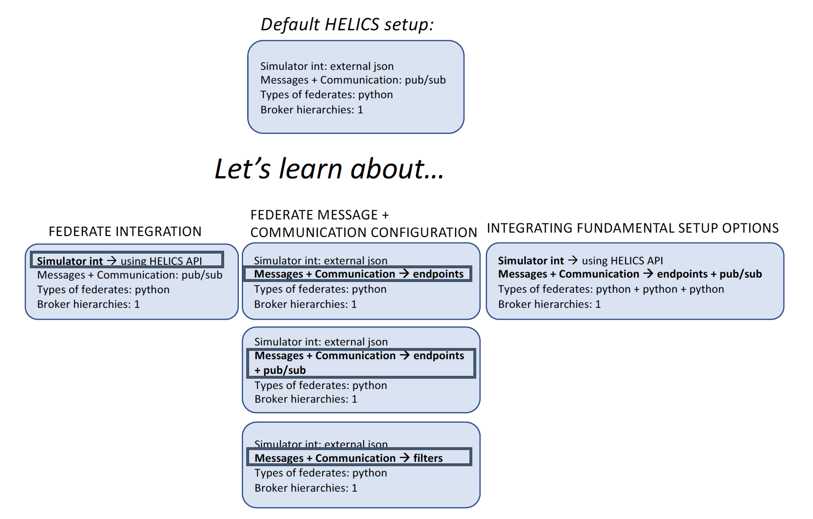

# Fundamental Examples


```eval_rst
.. toctree::
    :maxdepth: 1
    
    fundamental_default
    fundamental_fedintegration
    fundamental_communication
    fundamental_final

```


The Fundamental examples teach three concepts to build on a default setup:

1. Federate Integration with the API
2. Message and Communication Configuration
3. Integrating multiple concepts




The Fundamental examples are meant to build in complexity -- if you are new to HELICS, we recommend you start with the default setup.


## What are we modeling?

The model for the Fundamental examples is a co-simulation of a number of electric vehicle (EV) batteries and a charging port. A researcher may pose the question, "What is the state of charge of batteries on board EVs as they charge connected to a charging port?"

The Fundamental examples address this question with two federates: one to model the battery state of charge on board the EV, and a second to model the charging station delivering power. Each federate is responsible for calculating its internal components for a given number of instances of the physical entity.  For example, we can think of an EV parking garage as interfacing one-to-one between EVs and Chargers. In the figure below, the Battery (on board the EV) federate interfaces with the Charger (charging port) federate -- we have two federates in the co-simulation. If we want to model five EVs each connecting to a Charger, we need to __configure__ [link to configurations?] the communication between the two federates. The five EV-Charger connections are depicted below by the five two-sided arrows, indicating a unique communication pathway.


The examples in this section start with the simplest configuration method, which makes assumptions about the system which may not be completely valid but are reasonable for learning purposes.

Let's build our first HELICS co-simulation!