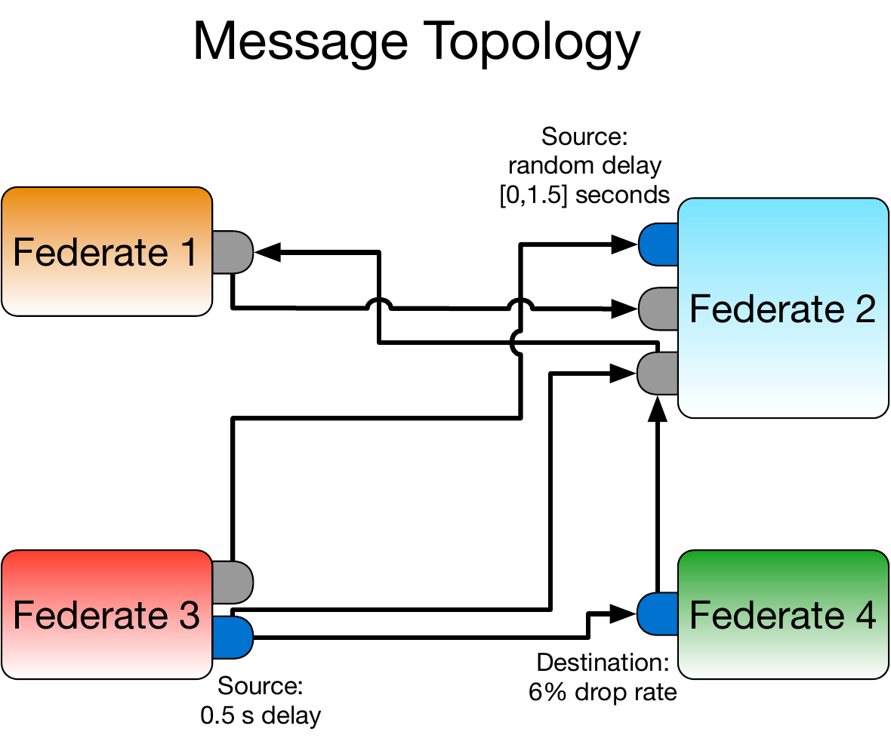
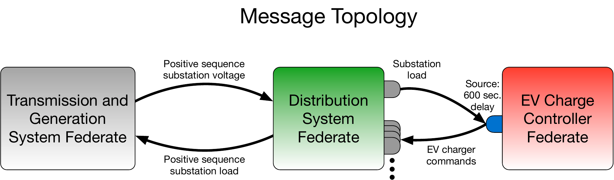
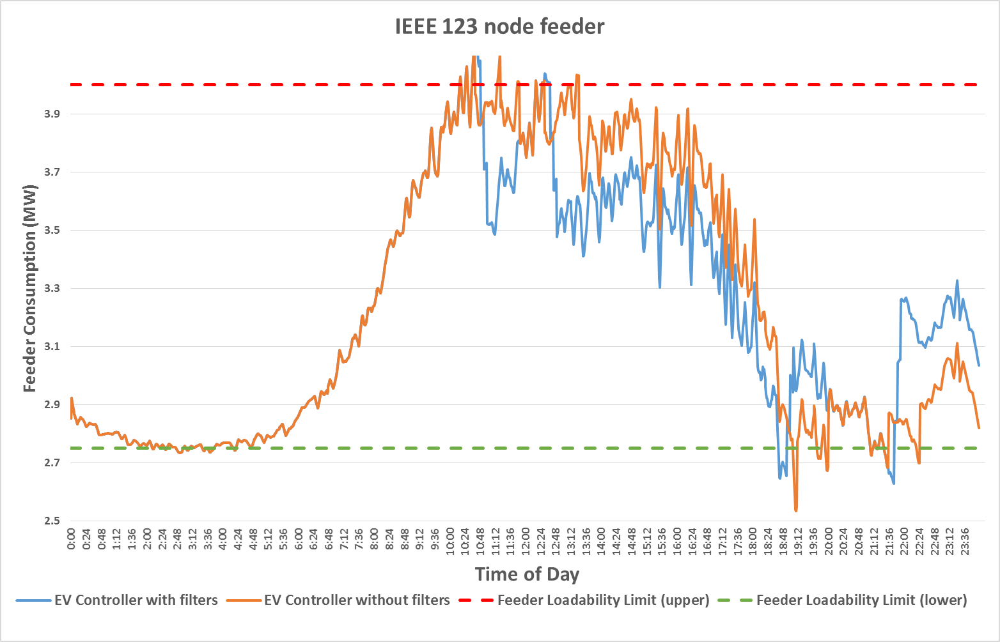
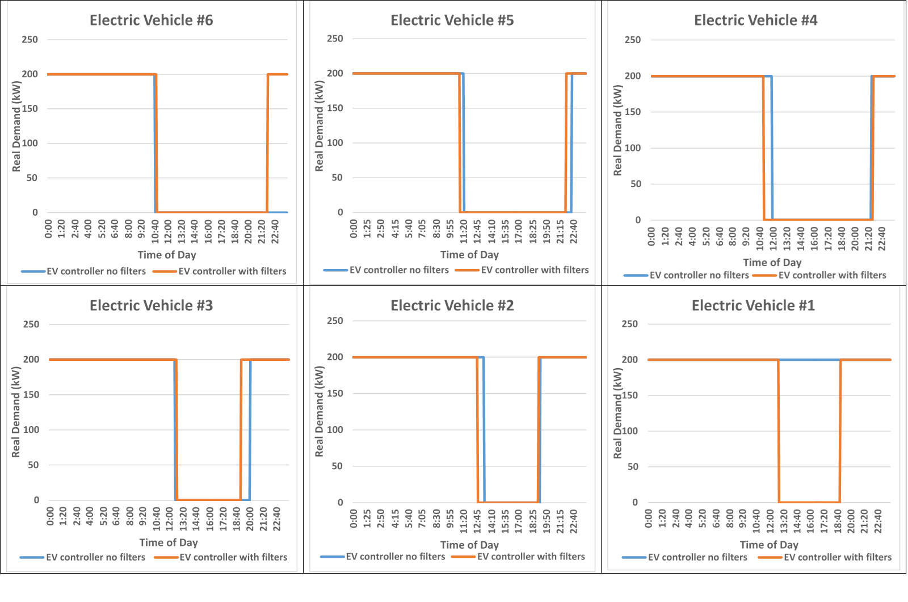

# HELICS Messages and Filters

As was introduced in the [introductory section on federates](./federates.md), message federates (and combo federates) are used to send messages (control signals, measurements, anything traveling over some kind of communication network) via HELICS to other federates. Though they seem very similar, the way messages and values are handled by HELICS is very different and is motivated by the underlying reality they are being used to model.

1. **Messages are directed and unique, values are persistent.** - Because HELICS values are used to represent physical reality, they are available to any subscribing federate at any time. If the publishing federate only updates the value, say, once every minute, any subscribing federates that are granted a time during that minute window will all receive the same value regardless of when they requested it.

   HELICS messages, though, are much more like other kinds of real-world messages in that they are directed and unique. Messages are sent by a federate from one endpoint to another endpoint in the federation (presumably the receiving endpoint is owned by another federate but this doesn't have to be the case). Internal to HELICS, each message has a unique identifier and can be thought to travel between a generic communication system between the source and destination endpoints.

2. **Messages can be filtered, values cannot.** - By creating a generic communication system between two endpoints, HELICS has the ability to model simple communication system effects on messages traveling through said network. These effects are called "filters" and are associated with the HELICS core (which in turn manages the federate's endpoints) embedded with the federate in question. Typical filtering actions might be delaying the transmission of the message or randomly dropping a certain percentage of the received messages. Filters can also be defined to operate on messages being sent ("source filters") and/or messages being received ("destination filters").

   Because HELICS values do not pass through this generic network, they cannot be operated on by filters. Since HELICS values are used to represent physics of the system not the control and coordination of it, it is appropriate that filters not be available to modify them. It is entirely possible to use HELICS value federates to send control signals to other federates; co-simulations can and have been made to work in such ways. Doing so, though, cuts out the possibility of using filters and, as we'll see, the easy integration of communication system simulators.

The figure below is an example of a representation of the message topology of a generic co-simulation federation composed entirely of message federates. Source and destination filters have been implemented (indicated by the blue endpoints), each showing a different built-in HELICS filter function.

- As a reminder, a single endpoint can be used to both send and receive messages (as shown by Federate 4). Both a source filter and a destination filter can be set up on a single endpoint. In fact multiple source filters can be used on the same endpoint.
- The source filter on Federate 3 delays the messages to both Federate 2 and Federate 4 by the same 0.5 seconds. Without establishing a separate endpoint devoted to each federate, there is no way to produce different delays in the messages sent along these two paths.
- Because the filter on Federate 4 is a destination filter, the message it receives from Federate 3 is affected by the filter but the message it sends to Federate 2 is not affected.
- As constructed, the source filter on Federate 2 has no impact on this co-simulation as there are no messages sent from that endpoint.
- Individual filters can be targeted to act on multiple endpoints and act as both source and destination filters.



## Example 1c - EV charge controller with HELICS filters

To demonstrate the effects of filters, let's take the same model we were working with in the [previous example](./message_federates.md), and add a filter to the controller. Specifically, let's assume a very, very poor communication system and add a 600 second delay to the control messages sent from the EV charge controller to each of the EVs.



[The JSON configuration file](https://github.com/GMLC-TDC/HELICS/tree/319de2b125fe5e36818f0434ac3d0a82ccc46534/examples/user_guide_examples/Example_1c/EV_Controller/Control.json) adds a new `filter` section that implements the filtering:

```json
...
"filters":
    [
        {
        "name":"filterEV6",
        "sourcetarget":"EV_Controller/EV6",
        "operation":"delay",
        "properties":
            {
            "name":"delay",
            "value":600
            }
        },
        {
        "name":"filterEV5",
        "sourcetarget":"EV_Controller/EV5",
        "operation":"delay",
        "properties":
            {
            "name":"delay",
            "value":600
            }
        },
        ...
    ]
```

- **`name`** (optional) - Name of the endpoint filter
- **`sourcetarget(s)`** - Name(s) of the endpoints to which this source filter will be applied
- **`desttarget(s)`** - Name(s) of the endpoints to which this destination filter will be applied
- **`operation`** - Defines the type of filtering operation that will be applied to messages. As of v2.0, the supported types are: `delay`, `timedelay`, `randomdelay`, `randomdrop`, `reroute`, `redirect`, `clone`, `cloning`, and `custom`. Further details on filter types can be found [here](../configuration/Filters.md).
- **`properties`** - Each filter type has specific parameters that define how it operates. In this case, one of those parameters is the amount each message will be delayed, in seconds.

Let's run [this co-simulation](https://github.com/GMLC-TDC/HELICS/tree/319de2b125fe5e36818f0434ac3d0a82ccc46534/examples/user_guide_examples/Example_1c/) and capture the same data as last time for direct comparison: total substation load and EV charging behavior, both as a function of time.





Granted that the charge controller communication system is ridiculously poor, this example does show that communication system effects can have a significant impact on system operation. For more realistic example, the HELICS Use Case repository has [an example](https://github.com/GMLC-TDC/HELICS-Use-Cases/tree/master/PNNL-Wide-Area-Control) of frequency control using real-time PMU measurements that shows the impact of imperfect communication systems.

## Explicit Communication System Modeling

HELICS filters are a simple, easy step to add a touch of realism to messages in the HELICS co-simulation. The simplicity of filters, though, may be inadequate at times. Real-world communication networks have dynamic delays and data loss rates, protocol effects, and more complex topologies. Sometimes, these effects are important (or may even be the point of the co-simulation) and an explicit communication system model is required to capture these effects.

The wonderful thing about the software architecture of HELICS is that simulators that have been properly modified to allow HELICS integration will seamlessly slide into the role of filters without having to reconfigure the sending and receiving federates. The move from native HELICS filters to full-blown communication system models is invisible. This is achieved by allowing user-defined nodes in a communication system model to be designated the filter for a given endpoint. All HELICS messages coming from that endpoint enter the communication system federate at that node and message being sent to that endpoint exit the communication system federate at that node. Conceptually, the change looks something like the figure below:


### Example 1d - EV charge controller with an ns-3 model

For this co-simulation, we're going to use [ns-3](https://www.nsnam.org) as our communication system model. Like many other detailed simulators, ns-3 is a complicated simulator, more complicated than can easily be explained in any detail here. If you're so interested, the [ns-3 tutorial](https://www.nsnam.org/docs/release/3.29/tutorial/html/index.html) is excellent and is the best place to start to understand how it is used to model and simulate communication systems. For those not wanting to dig into that, here's the three sentence version: ns-3 models the communication system topology as a collection of nodes and communication channels connecting them. Depending on the type of channel used, various properties (e.g. delay) can be assigned to them. On top of this network, various protocols can be assigned to build up the protocol stack with applications at the top of the stack.

When using HELICS and ns-3 together, the application that is installed is the bridge between the communication network and the rest of the HELICS federation. For each endpoint that is modeled in the communication network, a HELICS filter ns-3 application is installed at a corresponding node in the ns-3 model.

The specific ns-3 model built for this example uses the CSMA model built into ns-3 as a stand-in for a power-line carrier (PLC) communication system. Both CSMA and PLC use a bus topology with all transmitters attached to a common, shared communication channel. Each EV in the electrical network will be represented by a corresponding communication node. Older PLC implementations were known to be quite slow and we'll abuse and stretch this fact to force the average of the communication delays through the network to match that of the previous example. We'll also set the receiver at the substation to have a corresponding receive error rate.

First, you'll need to install [ns-3](https://www.nsnam.org/docs/release/3.29/tutorial/html/getting-started.html#downloading-ns-3-using-git) and add the [HELICS module](https://github.com/GMLC-TDC/helics-ns3). As the README indicates, HELICS for ns-3 is an extension that is simply plopped into the standard ns-3 distribution `contrib` folder and the configured with a few extra switches and compiled.

**EXAMPLE USING NS-3 AND HELICS IS UNDER DEVELOPMENT**

<!--
Touhid is developing the ns-3 model

First, to make sure the model is working as intended, let's verify that performance of the communication system model is different when using the native HELICS filters vs a stand-alone communication network simulator.

(xxxxxxx - histogram of delay times for one communication burst)

We can see that when using the native HELICS filters the arrival times of all the messages (ignoring those that were randomly dropped) is exactly xxxxxxx seconds. The arrival times for the messages flowing through the ns-3 model, though, are much more varied as we might expect from a more fully represented communication system model.

What impact does this model have on the performance of the system?

(xxxxxxx - graphs: Substation load (using results from 1b, 1c, 1d) vs time; Number of EVs charging (using results from 1b, 1c, 1d) vs time)

(xxxxxxx - Graph showing impact at transmission level due to communication system effects.)

As you can see, xxxxxxx
-->
