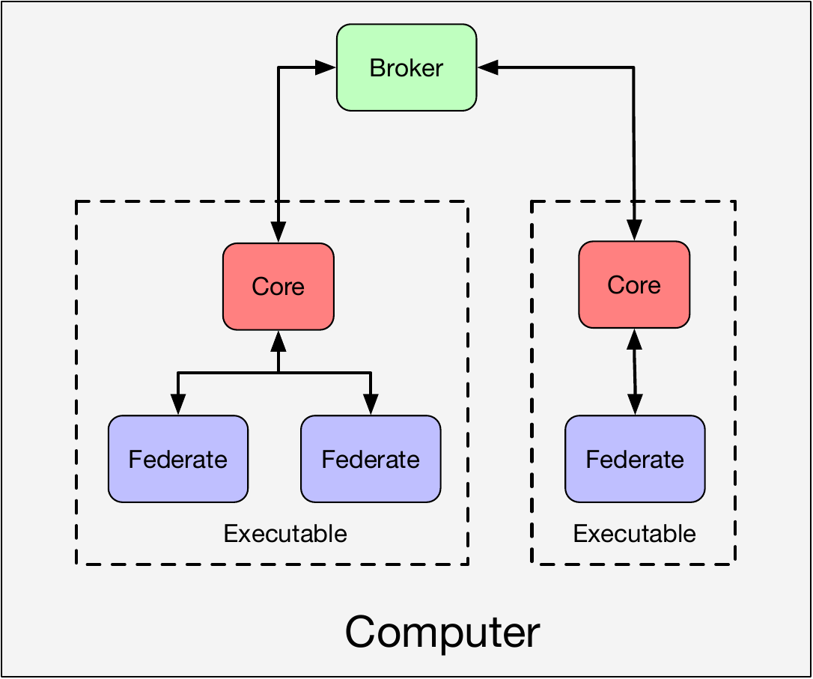
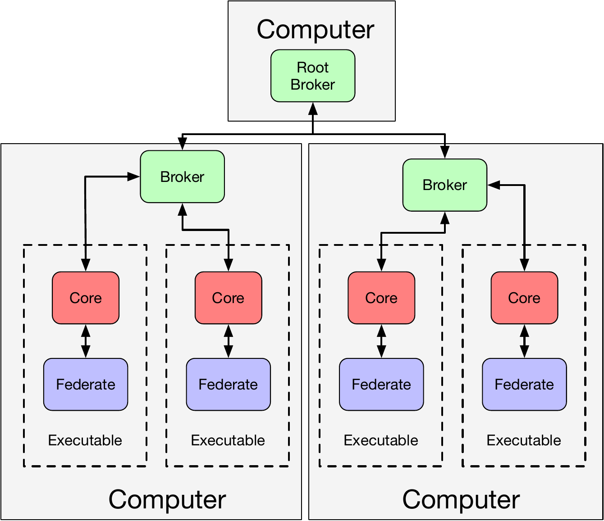

# HELICS Terminology

Before digging into the specifics of how a HELICS co-simulation runs, there are a number of key terms and concepts that need to be clarified first.

## Terms

- **Simulator** - A simulator is the executable that is able to perform some analysis function, often but not always, by solving specific problems to generate a time series of values. Simulators are abstract in the sense that it largely refers to the software in a non-executing state, outside of the co-simulation. We might say things like, "That simulator doesn't model xyz appropriately for this analysis." or "This simulator has been parallelized and runs incredibly quickly on many-core computers." Any time we are talking about a specific instance of a simulator running a specific model you are really talking about a...

- **Federate** - Federates are the running instances of simulators that have been assigned specific models and/or have specific values they are providing to and receiving from other federates. For example, we can have ten distribution circuit models that we are connecting for a co-simulation. Each could be run by the simulator GridLAB-D, and when they are running, they become ten unique federates providing unique values to each other. A collection of federates working together in a co-simulation is called a "federation."

- **Model** - A model is synonymous with an agent in the co-simulation. A simulator contains the calculations for the model. Depending on the needs of the co-simulation, a federate can be configured to contain one or many models. For example, if we want to create a co-simulation of electric vehicles, we may write a simulator (executable program) to model the physics of the electric vehicle battery. We can then designate any number of agents/models of this battery by configuring the transfer of signals between the "Battery Federate" (which has *N* batteries modeled) and another federate.

- **Signals** - Signals are the the information passed between federates during the execution of the co-simulation. Fundamentally, co-simulation is about message-passing via these signals. HELICS divides these messages into two types: value signals and message signal. The former is used when coupling two federates that share physics (_e.g._ batteries providing power to wheel motors on an electric car) and the later is used to couple two federates with information (_e.g._ a battery charge controller and a charge relay on a battery). There are various techniques and implementations of the message-passing infrastructure that have been implemented in the core. There are also a variety of mechanisms within a co-simulation to define the nature of the data being exchanged (data type, for example) and how the data is distributed around the federation.

- [**Core**](./CoreTypes.md) - The core is the software that has been embedded inside a simulator to allow it to join a HELICS federation. In general, each federate has a single core, making the two synonymous (core <=> federate). The two most common configurations are: (1) one core, one federate, one model; (2) one core, one federate, multiple models. There are sometimes cases where a single executable is used to represent multiple federates and all of those federates use a single core (one core, multiple federates, multiple models). Cores are built around specific message buses with HELICS supporting a number of different bus types. Selection of the message bus is part of the configuration process required to form the federation.

- **Broker** - The broker is a special executable distributed with HELICS; it is responsible for performing the two key tasks of a co-simulation: (1) maintaining synchronization in the federation and (2) facilitating message exchange. Each core (federate) must connect to a broker to be part of the federation. Brokers receive and distribute messages from any federates that are connected to it, routing them to the appropriate location. HELICS also supports a hierarchy of brokers, allowing brokers to pass messages between each other to connect federates associated with different brokers and thus maintain the integrity of the federation. The broker at the top of the hierarchy is called the "root broker" and it is the message router of last resort.

## HELICS Co-simulation Architectures

Given the definitions above, there are several co-simulation architectures that can be constructed where the relationships between this entities can vary.

### Simple Co-simulation

The figure below shows the most common architecture for HELICS co-simulation. Each core has only one federate as an integrated executable, all executables reside on the same computer and are connected to the same broker. This architecture is particularly common for small federates and/or co-simulations under development. This is also the architecture for the [Fundamental Examples](../examples/fundamental_examples/fundamental_examples_index.md).

### Multi-threading

The architecture below shows a scenario where more than one federate is associated with a single core. For most simulators that have already been integrated with HELICS this architecture would generally not be used. For simulators that are multi-threaded by nature, HELICS can be configured this way to facilitate message passing between threads. For a co-simulation that exists entirely within a single executable, this architecture will provide the highest performance. For example, of a large number of small controllers are written as a single, multi-threaded application (perhaps all the thermostats in an commercial building are being managed by a centralized controller), particularly where there is communication between the threads, using a single core inside a single multi-threaded application (with essentially one thread per federate) will provide the highest level of performance.

### Computationally Heavy Federates

For co-simulations on limited hardware where a federate requires significant computational resources and high performance is important, it may be necessary to spread the federates out across a number of compute nodes to give each federate the resources it needs. All federates are still connected to a common broker and it would be required that the computers have a valid network connection so all federates can communicate with this broker. In this case, it may or may not be necessary to place the broker on its own compute node, based on the degree of competition for resources on its current compute node.

### Multiple brokers

Alternatively, it would be possible to locate a broker on each computer and create a root broker on a third node. This kind of architecture could help if higher performance is needed and the federates on each computer primarily interact with each other and very little with the federates on the other computer. As compared to the previous architecture, adding the extra layer of brokers would keep local messages on the same compute node and reduce congestion on the root broker.

