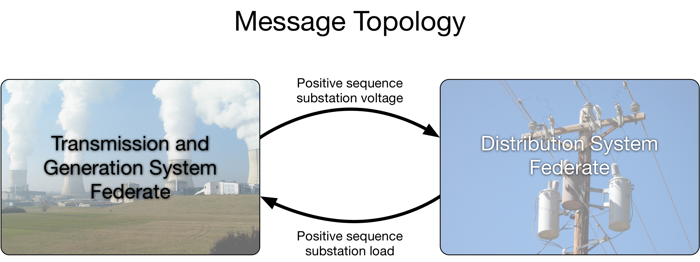
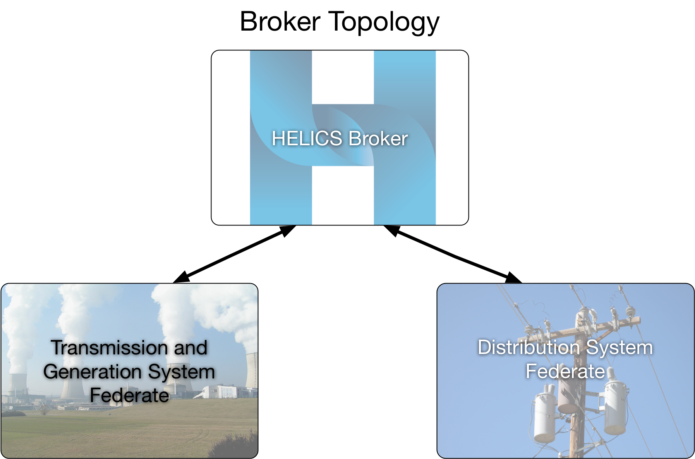

# Day in the Life of a HELICS Co-Simulation

As a co-simulation is, in some sense, a simulation of simulations, there are two levels of configuration required: the configuration of the individual federates as if they were running on their own (identifying models to be used, defining the start and stop time of the simulation, defining how the results of the simulation should be stored, etc..) and the configuration of how each federate will connect to the co-simulation and how it will interact with the other federates in the co-simulation. One of the goals of a co-simulation platform like HELICS is to make the later easier and more efficient by providing a standardized method of configuration. To provide a better understanding of why certain types of information are required during configuration and the implications of making certain choices, let's look at how a HELICS co-simulation is constructed and run, using the example of a generic transmission and distribution powerflow.

1. **Co-simulation design** - This isn't really a part of the co-simulation execution but is a step often overlooked. As a user, it will be up to you to understand the assumptions, modeling techniques, and dynamics of the simulators you are going to be tying together via HELICS. Using that knowledge you'll have to define the message topology (who is passing what information to whom) and the broker topology (which federates are connected to which brokers). The former is a matter of understanding the interactions of the system the simulators are trying to replicate and identifying the boundary conditions where they could exchange data. The later is somewhat optional (you can run a co-simulation with just a single broker) but offers an increase in performance if it is possible to identify groups of federates that interact often with each other but rarely with the rest of the federation. In such cases, assigning that group of federates their own broker will remove the congestion their messages cause with the federation as a whole.

   Using our example of an integrated transmission and distribution powerflow, its easy to think of each distribution circuit acting as a load on the transmission system and the transmission system, since most (sometimes all) of the generation is directly attached to it, acting as the supplier of energy for the distribution systems. Our co-simulation design, then, defines that the transmission system will provide voltages to the distribution system (as a result of solving its powerflow) and the distribution system will provide load values to the transmission system after using the provided voltages as their substation voltage and solving their powerflow.

   If you're familiar with transmission and distribution system simulation tools, you might have already realized that there is a bit of a mismatch in how those tools operate that creates a small problem in our design: typically transmission system solvers assuming a balanced (positive-sequence only) network while distribution systems are often more comprehensive and model all three phases and support imbalanced operation. This implies that the voltages being supplied to the distribution system will always be balanced and only the positive-sequence component of the distribution system load can be used by the transmission system. When defining the values that will be sent as messages between federates, it is important that these modeling differences be taken into account.

   Given the fact that only two federates are being used (the minimum number to be a co-simulation, though HELICS itself works just fine with a single federate), only a single broker is required.

   

   

2. **Configure the federates** - Every federate (instance of a simulator) will require configuration so that it correctly integrates with the federation. For simulators that already have HELICS support, the configuration takes the form of a JSON (or TOML) file; for simulators you might be integrating, the configuration can be done programmatically in code or via a JSON file as well. The essential information that HELICS configuration defines is:

   _Federate name_ - The unique name this federate will be known as throughout the federation. It is essential this name is unique so that HELICS messages can route properly.

   _Core type_ - The core manages interface between the federation and the federate; there are several messaging technologies supported by HELICS. All federates in the same federation must have the same core type(this requirement will be relaxed in the future).

   _Outputs and Inputs_ - Output configuration contains a listing of messages, data types, and units being sent by this federate; input configuration does the same for values being received by the federate. If supported by the simulator these values can be mapped to internal variables of the simulator from the configuration file. This is discussed in a [later section](./value_federates.md) on value messages in HELICS.

   _Endpoints_ - Endpoints are sending and receiving points for HELICS messages to and from message federates. They are declared and defined for each federate. Endpoints are further discussed in a [later section](./message_federates.md).

   _Time step size_ - This value defines the resolution of the simulator to prevent HELICS from telling the simulator to run to a time that is has no concept of (e.g. trying to simulate the time of 1.5 seconds when the simulator has a resolution of one second). Configuration of the timing is further discussed in the a later [section on timing](./timing.md).

   Below is an example of how a very generic configuration for the transmission federate could look followed by one for the distribution federate.

```json
    {
        "name":"transmission_federate",
        "coreType":"ZMQ"
        "publications":[
        {
            "key":"transmission_voltages",
            "type":"double",
            "unit":"V",
        }],
        "subscriptions":[
        {
            "key":"distribution_federate/distribution_loads",
            "type":"double",
            "required":true
        }],
    }
```

```json
    {
        "name":"distribution_federate",
        "coreType":"ZMQ"
        "publications":[
        {
            "key":"distribution_loads",
            "type":"double",
            "unit":"W",
        }],
        "subscriptions":[
        {
            "key":"transmission_federate/transmission_voltages",
            "type":"double",
            "required":true
        }],
    }
```

3. **Launch co-simulation/Initialize federates** - This will create the federates as entities recognized by the broker, set-up the communication channels for their messages to be passed, pass some initial messages and execute some preliminary code as preparation for the beginning of the co-simulation proper. The later is particularly important if the various federates need to reach a self-consistent state as an initial condition of the system.

   In our example, it may be important that when the co-simulation proper begins (t = 0) that the loads and resulting voltages that are solved for across both the transmission and distribution systems are in agreement. Or, depending on the specific purpose of the co-simulation, it may be acceptable for the first few powerflows to be less precise as the federates step through time towards a more consistent state across the federation.

4. **Time Request** - Once the initializing phase is complete, the co-simulation proper begins. Every federate, based on the system it is modeling and what information it needs to run that simulation, will request a simulation time from its core. This time request indicates the point in simulated time at which the federate knows it will have to run so it can simulate some portion of the model or behavior in the system. For example, there may be a federate simulating a building and based on the dynamics of the system, it knows the indoor temperature will not appreciably change over the next five minutes. More detailed discussion of time management is found in the [section on timing](./timing.md).

   In the case of running our integrated transmission and distribution powerflow, both federates only need to update when the other provides a new value. Effectively, the time request will determine the temporal resolution of the simulation. If loadshapes or historical data is being used by the distribution system to determine individual load co-efficients, the resolution of that data would define a lower bound for the temporal resolution. For this example, let's assume each federate only needs to update every five minutes.

5. **Time Grant** - Based on the time requests and grants from all the connected federates, a core will determine the next time it can grant to a federate to guarantee none of the federates will be asked to simulate a point in time that occurs in the past. That is, if the core is doing its job correctly, every federate will receive a time that is the same as or larger than the last time it was granted. HELICS does support a configuration and some other situations that allows a federate to break this rule but this is a very special situation and would require all the federates to support this jumping back in time, or accept non-causality and some randomness in execution. This and other aspects of granting time are discussed in more detail in [the section on timing](./timing.md).

6. **Simulate** - Once a federate has been charged with moving forward to a specific time (the granted time), the federate will execute its simulation, calculating its new state or behavior or control action to advance to that time. Prior to these calculations, it will receive any messages that have been sent to it by other federates and after simulating up to the granted time, may send out messages with new values other federates may need.

   In our powerflow example, every granted time both the transmission and distribution system use the previously published values from the other federate as a new input value (boundary condition) and runs a powerflow, re-solving their system. As you may have noticed, this can easily produce an inconsistent state as each federate is using data from the last time period (say, t = 10 minutes) to solve the state for this period (t = 15 minutes). Because new values are received by the federate only once a time has been granted and the granted time is typically forward in time, the data being received will generally be out of step like this. HELICS does support a re-iteration mode that allows the granted time to be the same as the current time; this is discussed in more detail in section [timing](./timing.md).

7. **Termination** - Steps three through six are repeated many many times until the federation has completed its simulation. At this point, if all has gone well, the federates gracefully signal their core that they are leaving the federation. Eventually, once all the federates have left, the rest of the infrastructure disassembles itself and also terminates.
