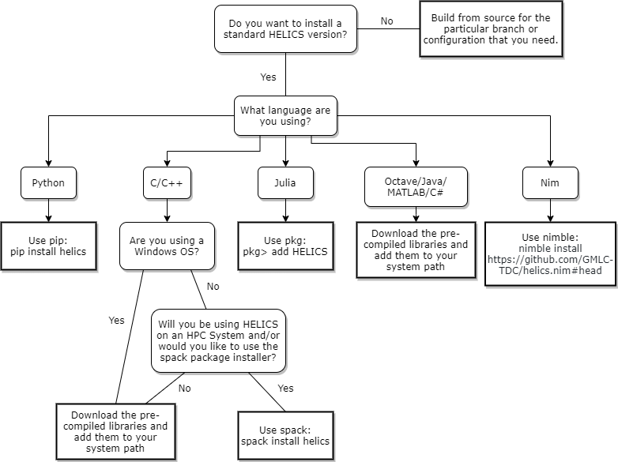

# HELICS Installation

```eval_rst
.. toctree::
    :maxdepth: 2


```

## HELICS applications

The first step to using HELICS is to install it. Since there are several ways to do this, the flow chart below provides some insight into what approach is likely to be the easiest depending upon a number of factors, most predominantly the programming language bindings that you intend to use. Below the flow chart you'll provide links to more complete instructions for each method. Note that you’ll need an internet connection for this process, as we’ll be downloading HELICS from the internet.



### pip install

[pip install helics](https://python.helics.org/)

### Download pre-compiled

[Download the pre-compiled libraries and add them to your system path](./installing_the_pre_compiled_libraries.md)

### spack install

[spack install helics](./spack.md)

### nimble install

[nimble install https://github.com/GMLC-TDC/helics.nim#head](https://github.com/GMLC-TDC/helics.nim)

### Build from source

[Build from source](./build_from_source.md)

## helics-cli

After installing HELICS, it can be helpful to also install the command line interface tool `helics-cli`. Instructions for installation can be found on the GMLC-TDC github page:

[pip install `helics-cli`](https://github.com/GMLC-TDC/helics-cli/#installation)

## helics-cli Installation

[helics-cli](https://github.com/GMLC-TDC/helics-cli) is a supporting tool that provides a simple and standardized way of launching HELICS-based co-simulations. This tool is used for [all the examples in this User Guide](../examples/examples_index.md) and thus its installation is highly recommended. (helics-cli also provides access to the [web interface for monitoring and debugging co-simulations](../fundamental_topics/web_interface), another good reason to install it.)

Installation of helics-cli is straightforward:

```shell session
pip install git+git://github.com/GMLC-TDC/helics-cli.git@main
```
