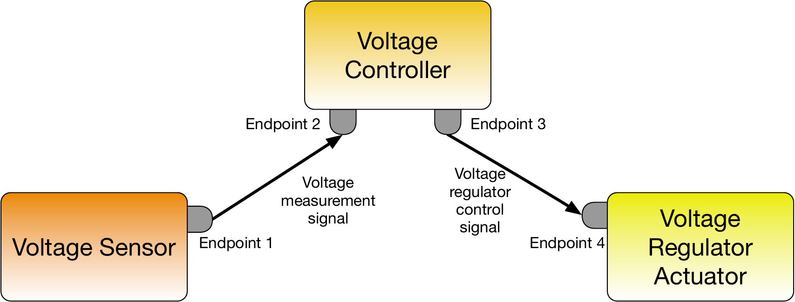
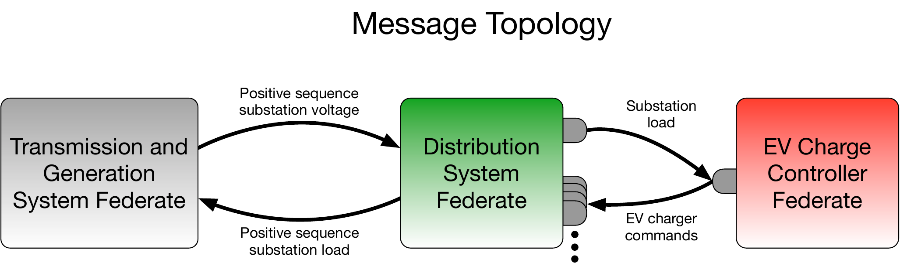
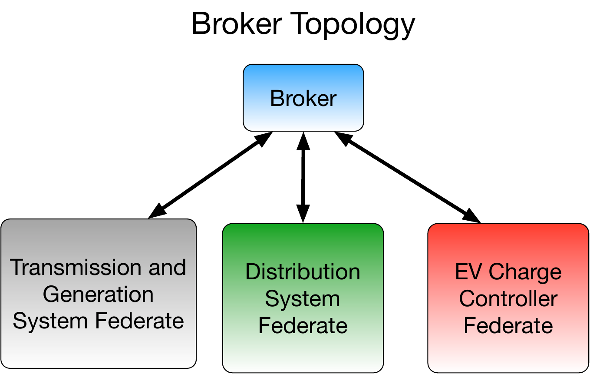
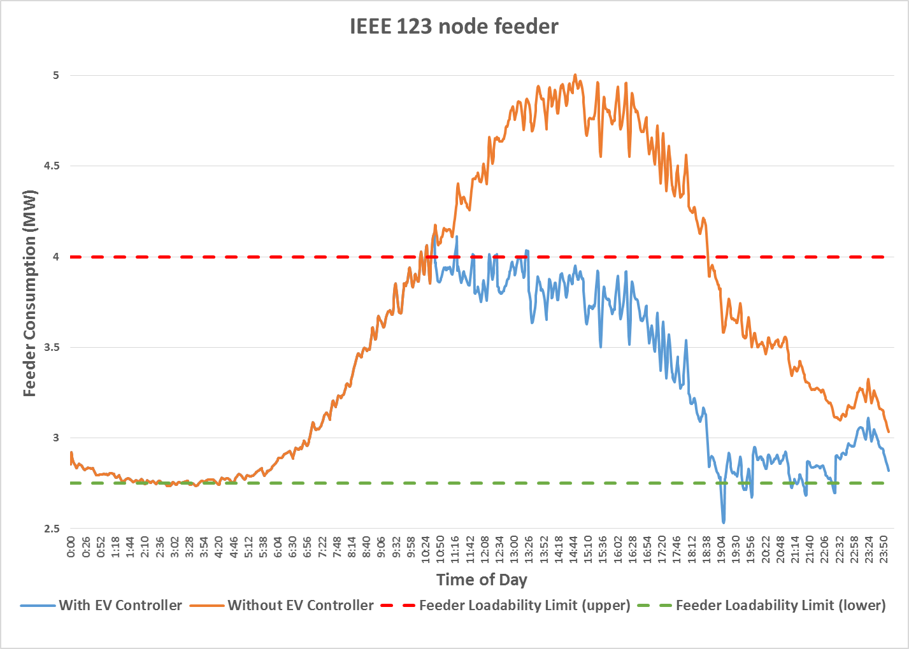
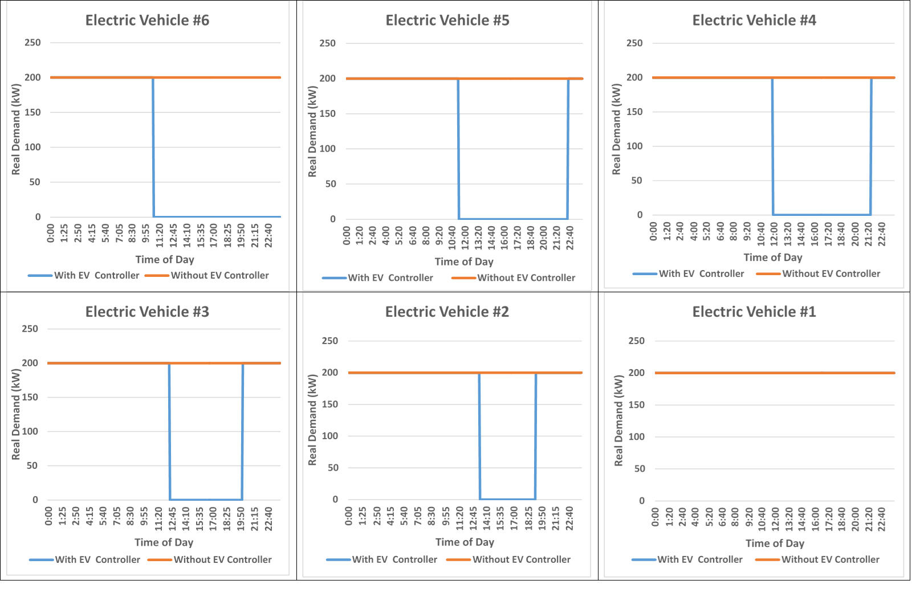
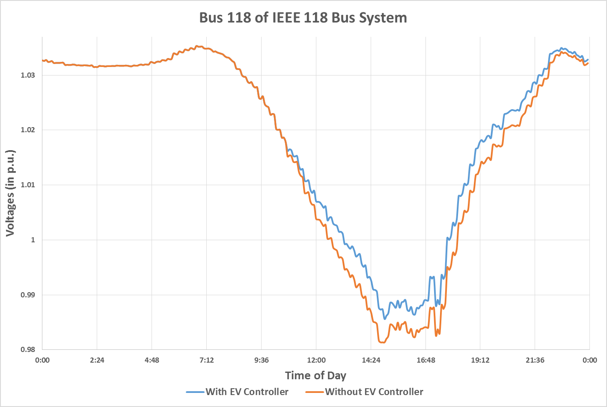

# Message Federates

As previously discussed in the [federate introduction](./federates.md), message federates are used to create HELICS messages that model information transfers (versus physical values) moving between federates. Measurement and control signals are typical applications for these types of federates.

Unlike HELICS values which are persistent (meaning they are continuously available throughout the co-simulation), HELICS messages are only readable once when collected from an endpoint. Once that collection is made the message only exists within the memory of the collecting message federate. If another message federate needs the information, a new message must be created and sent to the appropriate endpoint. Filters can be created to clone messages as well if that behavior is desired.

## Message Federate Endpoints

As previously discussed, message federates interact with the federation by defining an "endpoint" that acts as their address to send and receive messages. Message federates are typically sending and receiving measurements, control signals, commands, and other signal data with HELICS acting as a perfect communication system (infinite bandwidth, virtually no latency, guaranteed delivery).

In fact, as you'll see in [a later section](./filters.md), it is possible to create more realistic communication-system effects natively in HELICS (as well as use a full-blown communication simulator like [ns-3](https://www.nsnam.org) to do the same). This is relevant now, though, because it influences how the endpoints are created and, as a consequence, how the simulator handles messages. You could, for example, have a system with three federates communicating with each other: a remote voltage sensor, a voltage controller, and a voltage regulation actuator (we'll pretend for the case of this example that the last two are physically separated though they often aren't). In this case, you could imagine that the voltage sensor only sends messages to the voltage controller and the voltage controller only sends messages to the voltage regulation actuator. That is, those two paths between the three entities are distinct, have no interaction, and have unique properties (though they may not be modeled). Given this, referring to the figure below, the voltage sensor could have one endpoint ("Endpoint 1") to send the voltage signal, the voltage regulator could receive the measurement at one endpoint ("Endpoint 2") and send the control signal on another ("Endpoint 3"), and the voltage regulation actuator would receive the control signal on its own endpoint ("Endpoint 4").



The federate code handling these messages can be relatively simple because the data coming in or going out of each endpoint is unique. The voltage controller always receives (and only receives) the voltage measurement at one endpoint and similarly only sends the control signal on another.

Consider a counter-example: automated meter-reading (AMI) using a wireless network that connects all meters in a distribution system to a data-aggregator in the substation (where, presumably, the data travels over a dedicated wired connection to a control room). All meters will have a single endpoint over which they will send their data but what about the receiver? The co-simulation could be designed with the data-aggregator having a unique endpoint for each meter but this implies come kind of dedicated communication channel for each meter; this is not the case with wireless communication. Instead, it is probably better to create a single endpoint representing the wireless connection the data aggregator has with the AMI network. In this case, messages from any of the meters in the system will be flowing through the same endpoint and to differentiate the messages from each other, the federate will have to be written to examine the metadata with the message to determine its original source.


## Interactions Between Messages and Values

Though it is not possible to have a HELICS message show up at a value interface, the converse is possible; message_federates can subscribe to HELICS values. Every time a value federate publishes a new value to the federation, if a message federate has subscribed to that message HELICS will generate a new HELICS message and send it directly to the destination endpoint. These messages are queued and not overwritten (unlike in HELICS values) which means when a message federate is synchronized it may have multiple messages from the same source to manage.

This feature offers the convenience of allowing a message federate to receive messages from pure value federates that have no endpoints defined. This is particularly useful for simulators that do not support endpoints but are required to provide measurement signals controllers. Implemented in this way, though, it is not possible to later implement a full-blown communication simulator that these values-turned-messages can traverse. Such co-simulation architectures in HELICS require the existence of both a sending and receiving endpoint; this feature very explicitly by-passes the need for a sending endpoint.

## Message Federate Configuration in JSON

Once the message topology considering endpoints has been determined, the definitions of these endpoints in the JSON file is straight-forward. Here's what it could look like for the voltage regulator example from above.

```json
{
     ...
     "endpoints" : [
        {
            "name" : "voltage_sensor",
            "global" : true,
            "destination" : "voltage_controller",
            "info" : ""
        },
        {
            "name" : "voltage_controller_1",
            "global" : true,
            "info" : ""
        },
        {
            "name" : "voltage_controller_2",
            "global" : true,
            "destination" : "voltage_actuator",
            "info" : ""
        },
        {
            "name" : "voltage_actuator",
            "global" : true,
            "info" : ""
        }
     ...
     ]
}
```

- **`name`** - Analogous to `key` in value federates, this is the unique identifier of the endpoint in the federation and has the same interaction with `global` as the value federates do.
- **`global`** - Just as in value federates, `global` allows for the identifier of the endpoint to be declared unique for the entire federation.
- **`destination`** - For endpoints that send all outgoing messages to only a single endpoint, `destination` allows the endpoint to be specified in the JSON configuration. This allows for a more modular implementation of the federate since this parameter is externally defined rather than being hardcoded in the federate itself.
- **`info`** - Just as in the value federate, the string in this field is ignored by HELICS and can be used by the federate for internal configuration purposes.

There are a few other configuration parameters that are applicable if the endpoint is interacting with a HELICS value message.

- **`knownSubscription`** - The string in this field specifies the key for a HELICS value message that the message federate would like to receive at the specified endpoint. HELICS will generate a message and send it to this endpoint whenever the originating value federate updates to value.
- **`type`** and **`units`** - Just as in HELICS values, messages that come from value federates have associated data types and units. As in value federates, HELICS can use the specified `type` and `units` field to perform appropriate conversions. (As of v2.0, unit conversion is not supported.)

## Example 1b - Distribution system EV charge controller

To demonstrate how a message federate interacts with the federation, let's take the previous example and add two things to it: electric vehicle (EV) loads in the distribution system, and a centralized EV charge control manager.

Keeping in mind that this a model for demonstration purposes (which is to say, don't take this too seriously), let's make the following assumptions and definitions to simplify the behavior of the EV charge controller:

- All EVs are very large (200kW; level 2 charging is rated up to 20kW)
- All EVs have infinite battery capacity
- All EVs will be at home all day, desiring to charge all day if they can.
- All EVs charge at the same power level.
- The EV charge controller has direct control over the charging of all EVs in the distribution system. It can tell them when to turn off and on at will.
- The EV charge controller has the responsibility to limit the total load of the distribution system to a specified level to prevent overloading on the substation transformer.
- The EV will turn off some EV charging when the total distribution load exceeds the transformer limit by a certain percentage and will turn some EVs back on when below the limit by a certain percentage.
- Nothing is fair about how the charge controller chooses which EVs to charge and which to disconnect.

The message topology (including the endpoints) and the not very interesting broker topology are shown below.





Taking these assumptions and specifications, it is not too difficult to write a simple charge controller as a Python script. And just by opening the [JSON configuration file](https://github.com/GMLC-TDC/HELICS/tree/319de2b125fe5e36818f0434ac3d0a82ccc46534/examples/user_guide_examples/Example_1b/EV_Controller/Control.json) we can learn important details about how the controller works.

```json
{
    "name": "EV_Controller",
    "loglevel": 5,
    "coreType": "zmq",
    "timeDelta": 1.0,
    "uninterruptible": true,

    "endpoints":[
    {
        "name": "EV_Controller/EV6",
        "destination": "IEEE_123_feeder_0/EV6",
        "type": "genmessage",
        "global": true

    },
    {
        "name": "EV_Controller/EV5",
        "destination": "IEEE_123_feeder_0/EV5",
        "type": "genmessage",
        "global": true
    },
   ...
    ],
    "subscriptions":[
    {
        "key": "IEEE_123_feeder_0/totalLoad",
        "type": "complex",
        "required": true
    },
    {
        "key": "IEEE_123_feeder_0/charge_EV6",
        "type": "complex",
        "required": true
    },
    {
        "key": "IEEE_123_feeder_0/charge_EV5",
        "type": "complex",
        "required": true
    },
    ...
    ]
}
```

The first thing to note is the the EV controller has been written as a combination federate, having both endpoints for receiving/sending messages and subscriptions to HELICS values. The HELICS values that the controller has subscribed to give the controller access to both the total load of the feeder (`totalLoad`, presumably) as well as the charging power for each of the individual EVs being controlled (six in total).

Looking at the [GridLAB-D JSON configuration file](https://github.com/GMLC-TDC/HELICS/tree/319de2b125fe5e36818f0434ac3d0a82ccc46534/examples/user_guide_examples/Example_1b/Distribution/IEEE_123_feeder_0.json) confirms this:

```json
{
    "name" : "DistributionSim",
    "loglevel": 5,
    "coreType": "zmq",
    "period" : 1.0,
    "publications" : [
          {
               "global" : true,
               "key" : "IEEE_123_feeder_0/totalLoad",
               "type" : "complex",
               "unit" : "VA",
               "info" : "{
                    \"object\" : \"network_node\",
                    \"property\" : \"distribution_load\"
               }"
          },
          {
               "global" : true,
               "key" : "IEEE_123_feeder_0/charge_EV6",
               "type" : "complex",
               "unit" : "VA",
               "info" : "{
                    \"object\" : \"EV6\",
                    \"property\" : \"constant_power_A\"
               }"
          },
          {
               "global" : true,
               "key" : "IEEE_123_feeder_0/charge_EV5",
               "type" : "complex",
               "unit" : "VA",
               "info" : "{
                    \"object\" : \"EV5\",
                    \"property\" : \"constant_power_B\"
               }"
          },
          ...
          ],
     "endpoints" : [
        {
            "global" : true,
            "name" : "IEEE_123_feeder_0/EV6",
            "type" : "complex",
            "info" : "{
                \"object\" : \"EV6\",
                \"property\" : \"constant_power_A\"
            }"
        },
        {
            "global" : true,
            "name" : "IEEE_123_feeder_0/EV5",
            "type" : "complex",
            "info" : "{
                \"object\" : \"EV5\",
                \"property\" : \"constant_power_B\"
            }"
        },
        ...
    ]
}

```

GridLAB-D is publishing out the total load on the feeder as well as the individual EV charging loads. It also has endpoints set up for each of the EV chargers to receive messages from the controller. Based on the strings in the `info` field it appears that the received messages are used to define the EV charge power.

Running [the example](https://github.com/GMLC-TDC/HELICS/tree/319de2b125fe5e36818f0434ac3d0a82ccc46534/examples/user_guide_examples/Example_1b/) and looking at the results, as the total load on the feeder exceeded the pre-defined maximum loading of the feeder (red line in the graph), the EV controller disconnected an additional EV load. Conversely, as the load dipped to the lower limit (green line), the controller reconnected the EV load. Looking at a graph of the EV charge power for each EV shows the timing of the EV charging for each load.





Given the relatively dramatic changes in load, you might expect the voltage on the transmission system to be impacted. You would be right:


