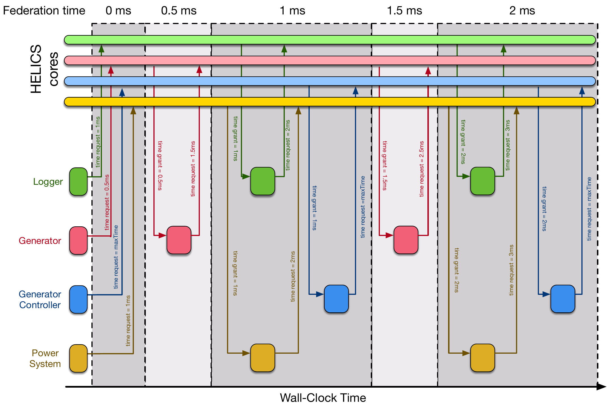

# Timing

The [section on federates](./federates.md) addressed the data-exchange responsibility of the co-simulation platform and this will address the timing and synchronization requirements. These two functions work hand-in-hand; for data-exchange between federates to be productive it must be delivered to each federate at the appropriate time. Co-simulation breaks down if federates are simulating different times (e.g. noon for one, 9am for another) and exchanging data as if they were operating at the same time; the system is no longer coherent.

As discussed in the [section providing the overview of co-simulation operation](./helics_co-sim_sequence.md) the primary mechanism HELICS uses to regulate the time of the individual federates (and thus the federation as a whole), is an iterative process of a federate requesting a simulated time to which it can advance and being granted that time (or another) by the federate's associated HELICS core. For example, a power system simulator may be ready to simulate the next second of operation and once its HELICS core has determined it is appropriate, it will grant the power system simulator that time.

To be clear, it is the role of each federate to determine which time it should request and it is the job of those integrating the simulator with HELICS to determine how best to estimate that value. For simulators that have no internal mechanisms for changing state (e.g. a power system at steady-state whose loads are time-invariant), a time request for infinity is made. (Technically, the value is a constant called `maxTime` which equals 1e12 seconds.). Until an input value changes, these federates have nothing to do and request that they are not granted a time until the co-simulation reaches a conclusion. If, instead of static load shapes that same simulator was using hourly load profiles, it would make more sense for the federate to make time requests in one-hour increments.

After making a time request, federates are granted a time by their HELICS core and the time they are granted will be one of two values: the time they requested(or the next available valid time) or an earlier valid time. Being granted a time earlier than requested is always accompanied by a new value in one of its subscriptions/endpoints. A change in the federates boundary conditions may require a change in one of the outputs (publications) for that federate and its core is obliged to wake up the federate so it can process this new information. (There are a few mechanisms by which trivial or nuisance updates for a federate can be ignored and will be discussed later in this section.)

So what does a federate do while its waiting to be granted a time? Generally, nothing. When a federate makes a time request it calls a HELICS function that blocks the execution of that thread in HELICS. (If the simulator in question is multi-threaded then other threads can continue to operate; hopefully whatever their working on is largely independent of the co-simulation). The federate sits and waits for a return value from that function (the granted time), allowing the rest of the federation to execute. The implication of making a time request is that, given the current state of its boundary conditions, the federate has nothing more to do until the time it is requesting (or until it receives a new value that changes its boundary conditions from another federate).

Relatedly, not all federates are granted the same simulation time. Thinking of our power system example with hourly loads, it could be that the power system federate makes hourly time requests while the controller, generally, requests `maxTime`, waiting for a new value to come in for it to act on. The power system federate would be granted times of 1pm, 2pm, 3pm, etc while the controller federate sits and waits in the time request blocking function. It would not know that the power system simulator is advancing in simulated time until it is granted a time itself (say, when the voltage at a certain node gets too high and triggers a publication from the power system simulator).

HELICS co-simulations end under one of two conditions: when all federates have been granted the time of `maxTime` or when all federates have notified the broker (via their core) that they are terminating and do so. The termination of the federates triggers a cascade of terminations throughout the federation: once all the federates associated with a core (often only one) have terminated, the core itself terminates and once all cores associated with a broker have terminated, the broker itself terminates. This concludes the co-simulation and leaves the original models, configuration files, executing simulators, and results files in place for review.

## Timing/Synchronization Options

The same JSON configuration file used to set the publications, subscriptions, and endpoints as discussed in the [section on federates](./federates.md) also has a number of parameters that can be set to influence how the federate manages its timing with the co-simulation.

```json
{
  "name":"generic_federate",
  ...
  "uninterruptible":false,
  "period":  1.0,
  "offset": 0.0,
  ...
}
```

- **uninterruptible [false]** - Normally, a federate will be granted a time earlier than it requested when it receives a message from another federate; the presence of any message implies there could be an action the federate needs to take and may generate new messages of its own. There are times, though, when it is important that the federate only be granted a time (and begin simulating/executing again) that it has previously requested. For example, there could be some controller that should only operate at fixed intervals even if new data arrives earlier. In these cases, setting the `uninterruptible` flag to `true` will prevent premature time grants.

- **period** - Many time-based simulators have a minimum time-resolution or a user-configurable step size. The `period` parameter can be used to effectively synchronize the times that are granted with the defined simulation period. The default units for `period` are in seconds but the string for this parameter can include its own units (e.g. "2 ms" or "1 hour"). Setting `period` will force all time grants to occur at times of `n*period` even if subscriptions are updated, messages arrive, or the federate requests a time between periods. This value effectively makes the federates `uninterruptible` during the times between periods. Relatedly...

- **offset [0]** - There may be cases where it is preferable to have a simulator receive time grants that are offset slightly in time to one or more other federates. Defining an `offset` value allows this to take place; units are handled the same as in `period`. Setting both `period` and `offset`, will result in the all times granted to the federate in question being constrained to `n*period + offset`.

- **timeDelta [0]** - timeDelta has some similarities to `period`; where `period` constrained the granted time to regular intervals, `timeDelta` constrains the grant time to a minimum amount from the last granted time. Units are handled the same as in `period`.

More than likely you're going to want to set at least one of these based on how the federate in question handles time (assuming that whoever integrated the federate didn't set any of them programmatically). For example, if the federate has a minimum time-step, setting `period` to that time-step value will guarantee that grants will only happen on that time-step. That is, if the federate has no concept of time shorter than one second, setting `period` to 1 second will guarantee that the federate is never granted a time of, say, 3.3 seconds even if new publication values arrive at that time. If those new values show up at 3.3 seconds and `period` is set to 1 second, the federate will see them when it is woken up at 4 seconds. HELICS will also delay any requests of invalid times to the next allowed time. For example if a period of 1.0 was set and request was made at 3.3 seconds the grant would occur at 4.0 seconds.

Alternatively, if the federate has been integrated in a manner such that it already makes time requests on the simulators minimum time-step, then setting `uninterruptible` will have the same effect. The federate will always request values on its time-step and any new publications or messages that arrive in between those time will be ignored. Also alternatively, setting `timeDelta` to the time-step and setting `uninterruptible` has the same effect as setting `period` to time-step (`uninterruptible` effectively becomes irrelevant and can be set or cleared).

Its important to note that these settings specifically impact the granted time and not the ability to make a time request. That is, with `period` set to 1 second and the current time is 3 seconds, making a time request of 3.1 seconds will not throw an error. It will generate a log warning message but this can be disabled as well; it will result in a time of 4 seconds being granted.

## Example: Timing in a Small Federation

Just for the purposes of illustration, let's suppose that a co-simulation federation with the following timing parameters has been assembled:

- **Logger** - This federate is a results logger and simply writes out to files the current values of various publications made by the other federates in the co-simulation. This logging simulator will record values every 1 ms and as such, the JSON config sets `period` to this value and sets the `uninterruptible` flag.
- **Generator** - This is a generator simulator that specializes in comprehensive modeling of the machine dynamics. The Generator will have an endpoint used to receive commands from the Generator Controller subscriptions to the Power System to provide the inputs necessary to replicate the physics of its system.

  The models of the generator are valid at a time-step of 0.1 ms and thus the simulator integrator requires that the `period` of the HELICS interface be set to some multiple of 0.1. In this case we'll use 1 ms and to ease integration with the Power System federate, it will also have an `offset` of 0.5 ms.

- **Generator Controller** - This is an event-based simulator, updating the control commands to the Generator federate whenever new inputs are received from the Power System federate (subscriptions to the physical values it calculates). As such, it will always request `maxTime`, expecting to be granted times whenever the state of the Power System federate changes. The `timeDelta` will be set to 0.010 ms to replicate the time it takes to calculate and communicate the command signals to the Generator.
- **Power System** - This federate is a classic power system dynamics simulator with a fixed time-step of 1 ms. The integrator of this simulator choose to realize this by setting the `uninterruptible` flag and hard-coding the time requests to advance at 1 ms intervals.

Below is a timing diagram showing how these federates interact during a co-simulation. The filled blocks show when each federate has been woken up and is active.



Items of notes:

- Generator Controller gets granted a time of 1 ms (at the first grant time) even though is requested `maxTime` because a message was created by the Power System federate at that time stamp. As Generator Controller depends on nothing else, HELICS was able to grant it the same time as Power System even though it is clearly performing its calculations after Power System has performed its.
- Relatedly, Generator Controller requests a time of `maxTime` once it has calculated the new control signals for Generator. Due to the value set by `timeDelta`, the soonest time it can be granted would be 0.01 ms after its most recent granted time (1.01 in the case of the first operational period, 2.01 in the case of the second period.)
- When Logger is granted a time of 1 ms, the values it will record are those previously published by other federates. Specifically, the new values that Power System is calculating are not available for Logger to record.

## Exercises

To get a reader some practice on how timing working in HELICS some exercises originally used as part of an in person tutorial are [available](./timing_exercise.md)
