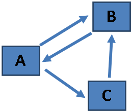

# Exercises in Co-simulation timing

A few simple exercises about co-simulation timing

## Key Parameters

- **Period**: The minimum time resolution a federate will allow.
- **Offset**: a shift in the period. Allowed times for federate grants after time 0 are `offset+N*period`, where `N` is a non-negative integer.
- **Time_delta**: the minimum time between grants, i.e. if a federate is granted time T, the next possible time is `T+Time_delta`.

## Modifier Flags

- **Uninteruptible**: a federate can only be granted requested times
- **wait_for_current_time_update**: specify that a federate should wait until all federates executing at the current time have finished.

1. Federation Setup \[A: period=1; B: period=2; C: period=3\]

   a. Following time 0, which federate could execute next? `___________________________`

   b. If all federates execute at all allowed times, what is the next time Federate B could have access to data from Federate C. `__________________`

   c. What is the next time all federate will be able to execute simultaneously? `__________________`

   **Key Principle**: _Federates are interrupted if there is updated data available and allowed time prior to the requested time_

2. Federation Setup \[A: period=1,`wait_for_current_time_update`; B: period=2; C: period=3\]

   a. At what time will the data from Federate B published at time 2, be available to Federate A? `______________`

   b. Federate A requests time 4: Federate B publishes at time 2. What time is Federate A granted? `_____________`

   c. Federate A requests time 2: Federate B publishes at time 2. What time does Federate A receive the data? `_________________`

   e. If A did not have the `wait_for_current_time_update` flag active, what time would Federate A receive the data? `________________`

   **Key Principle**: _Federates are granted the next allowed time after the time specified in a request if they are not interrupted._

3. Federation Setup \[A: period=1; B: period=2,offset=1,time_delta=2; C: period=3\]

   a. After time=0 what is the next allowable time for Federate B? `_______________`

   b. Federate C requested a time of 4, what time is Federate C granted? `_______________`

4. Federation Setup \[A: period=1; B: period=2,uninterruptible; C: period=3\]

   a. Federate C Publishes at time 3, Federate B requests time 6, what time will it be granted?`______________`

   b. If Federate B were not uninterruptible what time would it be granted? `_______________`

   

5. Federation Setup \[A: period=1; B: period=2; C: period=3\], Federates will send an update when they have received an update from the all other connected federates. Federate A sends an update at time 0, what is the update sequence

| Time | Federate(s) |
| ---- | :---------: |
|      |             |
|      |             |
|      |             |
|      |             |
|      |             |
|      |             |
|      |             |

---

For answers see [answers](timing_exercise_answers.md)
