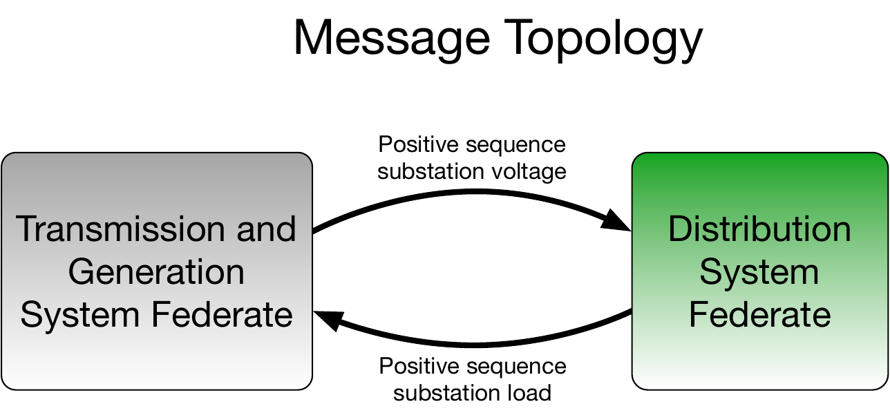
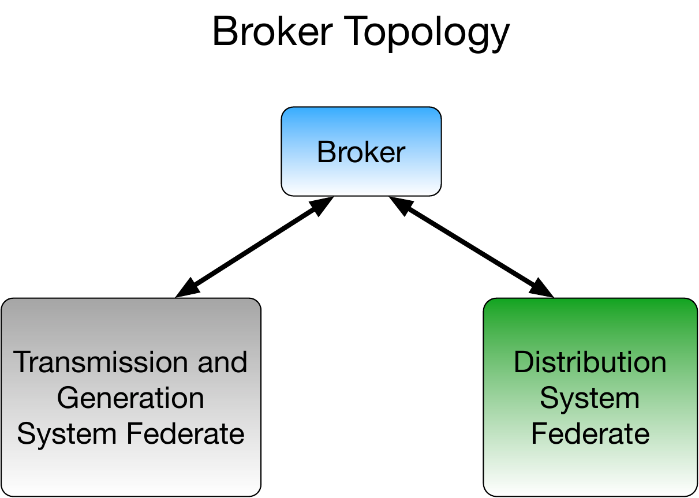
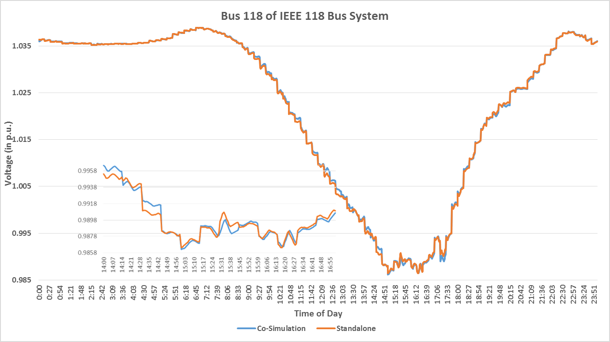
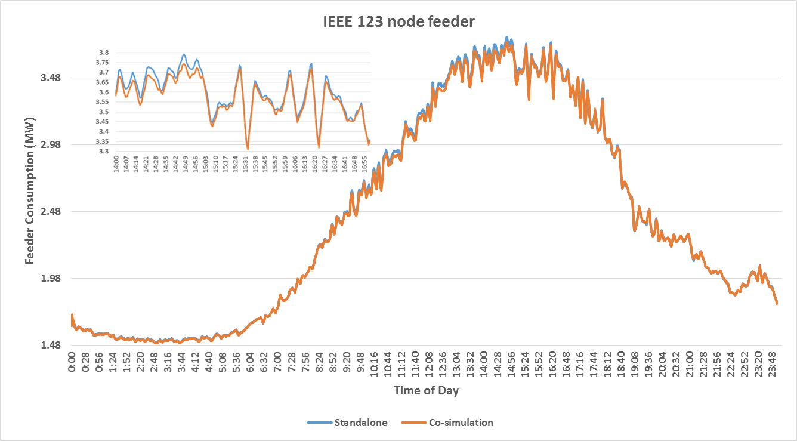

# Value Federates

HELICS messages that are value-oriented are the most common type of messages. As mentioned in the [federate introduction](./federates.md), value messages are intended to be used to represent the physics of a system, linking federates at their mutual boundaries and allowing a larger and more complex system to be represented than would be the case if only one simulator was used.

## Value Federate Message Types

There are four interface types for value federates that allow the interactions between the federates (a large part of co-simulation/federation configuration) to be flexibly defined. The difference between the four types revolve around whether the interface is for sending or receiving HELICS messages and whether the sender/receiver is defined by the federate (technically, the core associated with the federate):

- **Publications** - Sending interface where the federate core does not specify the intended recipient of the HELICS message
- **Named Inputs** - Receiving interface where the federate core does not specify the source federate of the HELICS message
- **Directed Outputs** - Sending interface where the federate core specifies the recipient of HELICS message
- **Subscriptions** - Receiving interface where the federate core specifies the sender of HELICS message

In all cases the configuration of the federate core declares the existence of the interface to use for communicating with other federates. The difference between "publication"/"named inputs" and "directed outputs"/"subscriptions" is where that federate core itself knows the specific names of the interfaces on the receiving/sending federate core.

The message type used for a given federation configuration is often an expression of the preference of the user setting up the federation. There are a few important differences that may guide which interfaces to use:

- **Which interfaces does the simulator support?** - Though it is the preference of the HELICS development team that all integrated simulators support all four types, that may not be the case. Limitations of the simulator may limit your options as a user of that simulator.
- **Is portability of the federate and its configuration important?** - Because "publications" and "named inputs" don't require the federate to know who it is sending HELICS messages to and receiving HELICS messages from as part of the federate configuration, it affords a slightly higher degree of portability between different federations. The mapping of HELICS messages still needs to be done to configure a federation, its just done separately from the federate configuration file via a broker or core configuration file. The difference in location of this mapping may offer some configuration efficiencies in some circumstances.

Though all four message types are supported, the remainder of this guide will focus on publications and subscriptions as they are conceptually easily understood and can be comprehensively configured through the individual federate configuration files.

## Federate Configuration Options via JSON

For any simulator that you didn't write for yourself, the most common way of configuring that simulator for use in a HELICS co-simulation will be through the use of an external JSON configuration file. TOML files are also supported but we will concentrate on JSON for this discussion. This file is read when a federate is being created and initialized and it will provide all the necessary information to incorporate that federate into the co-simulation.

As the fundamental role of the co-simulation platform is to manage the synchronization and data exchange between the federates, you may or may not be surprised to learn that there are generic configuration options available to all HELICS federates that deal precisely with these. In this section, we'll focus on the options related to data exchange as pertaining to value federates, those options and in [Timing section](./timing.md) we'll look at the timing parameters.

Let's look at a generic JSON configuration file as an example with the more common parameters shown; the default values are shown in "[ ]". (Further parameters and explanations can be found in the [federate configuration](../configuration/Federate.md) guide.

### General Configuration Parameter

Though contained here in this section on value federates, the options below are applicable to both value and message federates. As value federates are the more common type, we've put them here.

```json
{
    ...
    "name":"generic_federate",
    "coreType": "zmq"
    ...
}
```

- **`name`** - Every federate must have a unique name across the entire federation; this is functionally the address of the federate and is used to determine where HELICS messages are sent. An error will be generated if the federate name is not unique.
- **`coreType` [zmq]** - There are a number of technologies or message buses that can be used to send HELICS messages among federates. Every HELICS enabled simulator has code in it that creates a core which connects to a HELICS broker using one of these messaging technologies. ZeroMQ (zmq) is the default core type and most commonly used but there are also cores that use TCP and UDP networking protocols directly (forgoing ZMQ's guarantee of delivery and reconnection functions), IPC (uses Boost's interprocess communication for fast in-memory message-passing but only works if all federates are running on the same physical computer), and MPI (for use on HPC clusters where MPI is installed).

### Value Federate Data Exchange Options

```json
{
    ...
    "only_update_on_change":false, //indicator that the federate should only indicate updated values on change
    "only_transmit_on_change":false,  //indicator that the federate should only publish if the value changed
    "source_only":false,
    "observer":false,
    ...
}
```

- **`only_update_on_change` [false]** - In some cases a federate may have subscribed to a value that changes infrequently. If the publisher of that makes new publications regularly but the value itself has not changed, setting this flag on the receiving federate will prevent that federate from being sent the new, but unchanged value and having to reprocess it's received data when nothing has changed. Note that this flag will only prevent the old value from getting through if it is bit-for-bit identical to the old one.

- **`only_transmit_on_change` [false]** - Complementary to `only_update_on_change`, this flag can be set to prevent identical values from being published to the federation if they have not changed.

- **`source_only` [false]** - Some federates may exist only to provide data for the federation to use in their calculations. If using such a federate, set the `source_only` flag to `true`; doing so allows for slightly more efficient synchronization and higher performance of the federation.

- **`observer` [false]** - Conversely, some federates may only participate in the federation by recording values (perhaps for diagnostic purposes or for logging results). If using such a federate, set the `observer` flag to `true` to achieve similar efficiencies as in the `source_only` flag.

### Value Federate Interface Configuration

```json
{
     "publications" : [
          {
               "key" : "IEEE_123_feeder_0/totalLoad",
               "global" : true,
               "type" : "complex",
               "unit" : "VA",
               "info" : "{
                    \"object\" : \"network_node\",
                    \"property\" : \"distribution_load\"
               }"
          },
          {
          ...
          }
     ],
     "subscriptions" : [
          {
               "required": true,
               "key" : "TransmissionSim/transmission_voltage",
               "type" : "complex",
               "unit" : "V",
               "info" : "{
                    \"object\" : \"network_node\",
                    \"property\" : \"positive_sequence_voltage\"
                    }"
          },
          {
          ...
          }
     ]
}
```

- **`publications` and/or `subscriptions`** - These are lists of the values being sent to and from the given federate.
- **`key`** -
  - `publications` - The string in this field is the unique identifier (at the federate level) for the value that will be published to the federation. If `global` is set (see below) it must be unique to the entire federation.
  - `subscriptions` - This string identifies the federation-unique value that this federate wishes to receive. Unless `global` has been set to `true` in the publishings JSON configuration file, the name of the value is formatted as `<federate name>/<publication key>`. Both of these strings can be found in the publishing federate's JSON configuration file as the `name` and `key` strings, respectively. If `global` is `true` the string is just the `key` value.
- **`global` [false]** - (publications only) `global` is used to indicate that the value in `key` will be used as a global name when other federates are subscribing to the message. This requires that the user ensure that the name is used only once across all federates. Setting `global` to `true` is handy for federations with a small number of federates and a small number of message exchanges as it allows the `key` string to be short and simple. For larger federations, it is likely to be easier to set the flag to `false` and accept the extra naming
- **`required` [false]** -
  - `publications` - At least one federate must subscribe to the publications.
  - `subscriptions` - The message being subscribed to must be provided by some other publisher in the federation.
- **`type`** - HELICS supports data types and data type conversion ([as best it can](https://www.youtube.com/watch?v=mZOAn-3aATY)).
- **`units`** - HELICS is able to do some levels of unit conversion, currently only on double type publications but more may be added in the future. The units can be any sort of unit string, a wide assortment is supported and can be compound units such as m/s^2 and the conversion will convert as long as things are convertible. The unit match is also checked for other types and an error if mismatching units are detected. A warning is also generated if the units are not understood and not matching. The unit checking and conversion is only active if both the publication and subscription specify units.
- **`info`** - The `info` field is entirely ignored by HELICS and is used as a mechanism to pass configuration information to the federate so that it can properly integrate into the federation. Thus, there is no standard content or format for this field; it is entirely up to the individual simulators to decide how the data in this field (if any) should be used. Often it is used by simulators to map the HELICS names into internal variable names as shown in the above example. In this case, the object `network_node` has a property called `positive_sequence_voltage` that will be updated with the value from the subscription `TransmissionSim/transmission_voltage`.

## Example 1a - Basic transmission and distribution powerflow

To demonstrate how a to build a co-simulation, an example of a simple integrated transmission system and distribution system powerflow can be built; all the necessary files are found [here](../../examples/user_guide_examples/Example_1a) but to use them you'll need to get some specific software installed; here are the instructions:

1.  [HELICS](https://helics.readthedocs.io/en/latest/installation/index.html)
2.  [GridLAB-D](https://github.com/gridlab-d/gridlab-d/tree/develop) - Enable HELICS, see instructions [here](http://gridlab-d.shoutwiki.com/wiki/Connection:helics_msg)
3.  [Python](https://www.anaconda.com/download/) - Anaconda installation, if you don't already have Python installed. You may need to also install the following Python packages (`conda install` ...)
    - matplotlib
    - time
    - logging
4.  [PyPower](https://pypi.org/project/PYPOWER/) - `pip install pypower`
5.  [helics_cli](https://github.com/GMLC-TDC/helics-cli) - `pip install git+git://github.com/GMLC-TDC/helics-cli.git@master`

This example has a very simple message topology (with only one message being sent by either federate at each time step) and uses only a single broker. Diagrams of the message and broker topology can be found below:





- **Transmission system** - The transmission system model used is the IEEE-118 bus model. To a single bus in this model the GridLAB-D distribution system is attached. All other load buses in the model use a static load shape scaled proportionately so the peak of the load shape matches meet the model-defined load value. The generators are re-dispatched every fifteen minutes by running an optimal power flow (the so-called "ACOPF" which places constraints on the voltage at the nodes in the system) and every five minutes a powerflow is run the update the state of the system. To allow for the relatively modest size of the single distribution system attached to the transmission system, the distribution system load is amplified by a factor of fifteen before being applied to the transmission system.

- **Distribution system** - A GridLAB-D model of the IEEE-123 node distribution system has been used. The model includes voltage regulators along the primary side of the system and includes secondary (or distribution) transformers with loads attached to the secondary of these transformers. The loads themselves are ZIP loads with a high impedance traction that are randomly scaled versions of the same time-varying load-shapes.

In this particular case, the Python script executing the transmission model also creates the broker; this is a choice of convenience and could have been created by any other federates. This simulation is run for 24 hours.

### Running co-simulations via helics_cli

To run this simulation, the HELICS team has also developed an application called `helics_cli` (command line interface) which, among other uses, creates a standardized means of launching co-simulations. The application can be downloaded from the [helics_cli repository](https://github.com/GMLC-TDC/helics-cli). Discussion of how to configure `helics_cli` for a given simulation is discussed in the [section on helics_cli](./helics_cli.md) but for all these examples, the configuration has already been done. In this case, that configuration is in the examples folder as "cosim_runner_1a.json" and looks like this:

```json
{
  "broker": false,
  "federates": [
    {
      "directory": "./Transmission/",
      "exec": "python Transmission_simulator.py",
      "host": "localhost",
      "name": "PythonCombinationFederate"
    },
    {
      "directory": "./Distribution/",
      "exec": "gridlabd IEEE_123_feeder_0.glm",
      "host": "localhost",
      "name": "GridLABDFederate"
    }
  ],
  "name": "Example-1a-T-D-Cosimulation-HELICSRunner"
}
```

Briefly, it's easy to guess what a few of these parameters do:

- "directory" is the location of the model to be run
- "exec" is the command line call (with all necessary options) to launch the co-simulation

With a properly written configuration file, launching the co-simulation becomes very straightforward:

`helics run --path <path to helics_cli configuration file>`

### Experiment and Results

To show the difference between running these two simulators in a stand-alone analysis and as a co-simulation, modify the federate JSON configurations and use helics_cli in both cases to run the analysis. To run the two as a co-simulation, leave publication and subscription entries in the federate JSON configuration. To run them as stand-alone federates with no interaction, delete the publications and subscriptions from both JSON configuration files. By removing the information transfer between the two they become disconnected but are still able to be executed as if they were participating in the federation.

The figure below shows the total load on the transmission node to which the distribution system model is attached over the course of the simulated day, both when operating stand-alone and when running in a co-simulation with the distribution system.



As can be seen, the impacts of co-simulation are relatively modest in this case. Even when the transmission system provides a dynamic high-side substation voltage (rather than just assuming a fixed value) and even with loads that have been created to be very voltage sensitive, the changing substation voltage doesn't impact the load substantially and change the voltage profiles significantly. (If you're curious to see an even bigger impact, you can disable the voltage regulators in GridLAB-D by editing the `regulator_configuration` objects so that the `Control` parameter is set to `MANUAL`. This will lock the regulators into place and allow the substation voltage to propagate through the circuit unregulated.) (xxxxxxx - double-check this.)

The load of the distribution circuit as seen by the transmission model with and without co-simulation is similarly muted.


